This paper introduces and investigates the concept of "representation alignment" in neural networks, demonstrating its emergence during training and its correlation with transfer learning performance.

### 1. Problem Statement

The core problem addressed is the lack of understanding regarding *why* neural network representations are so successful for transfer learning, particularly the underlying properties of learned hidden representations that facilitate this success. Existing approaches often focus on properties like disentanglement or invariance, or simply measure expressivity. The paper aims to move beyond these by proposing a quantifiable measure that correlates with improved optimization behavior (convergence rate) and generalization ability in transfer settings, and to investigate whether this property emerges consistently across diverse neural network architectures and training regimes.

### 2. Methodology

The authors define **representation alignment** as a relationship between a learned representation matrix ($\Phi$) and a label vector ($y$). Specifically, it quantifies how much of the label vector's projection is concentrated on the singular vectors corresponding to the largest singular values of $\Phi$. The measure is formally defined as:

$$
\text{Alignment}(\Phi, y, \tau) = \sum_{\{i : \sigma_i \ge \tau\}} (u_i^T y)^2
$$

where $\sigma_i$ are the singular values of $\Phi$, $u_i$ are the corresponding left singular vectors, and $\tau$ is a threshold. Higher alignment indicates that the target information is concentrated in the principal directions of the representation where data is more spread out, which is theoretically linked to faster convergence in gradient descent.

The methodology involves:
*   **Empirical Study**: Analyzing alignment in hidden representations of neural networks trained on various tasks (UCI CT Position, MNIST, Cifar10/100, synthetic peaks functions, Office-31).
*   **Architectures & Optimizers**: Testing MLPs with varying depths (1-5 layers), widths (64-256 units), activation functions (ReLU, Tanh, PReLU, LeakyReLU, Linear), and optimizers (Adam, SGD, RMSProp).
*   **Pre-trained CNNs**: Evaluating alignment in established high-performance CNNs like VGG16, ResNet50, ResNet101, and T2T-ViT, pre-trained on ImageNet.
*   **Comparison Baselines**: Comparing neural network alignment against original input features, randomly initialized networks, sparse dictionary learning, RBF networks, and handcrafted features (SIFT, HOG).
*   **Transfer Learning Evaluation**: Using features extracted from a source-trained network to train a linear model on a target task, assessing convergence rates, generalization performance, and correlation with alignment for both positive and negative transfer scenarios.
*   **Theoretical Grounding**: Leveraging existing theoretical results (e.g., Arora et al., Oymak et al.) that connect alignment of labels with singular vectors to improved convergence rates and generalization.

### 3. Key Results & Analysis

The paper demonstrates several key findings:

*   **Emergence of Alignment**: Training a neural network significantly increases the representation alignment between its hidden features and the label vector, even when the original input features have low alignment or labels are shuffled. [Image 2 (c,d)], 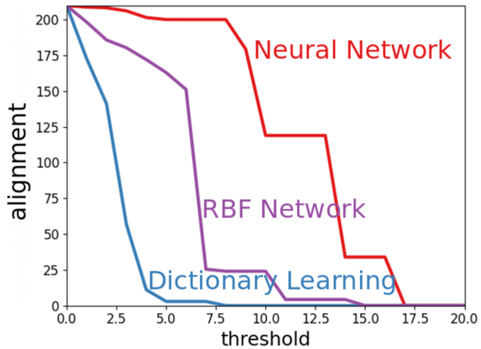
*   **Architecture and Training Robustness**: Alignment emerges consistently across different depths, widths, activation functions (including linear), batch sizes, and optimizers. 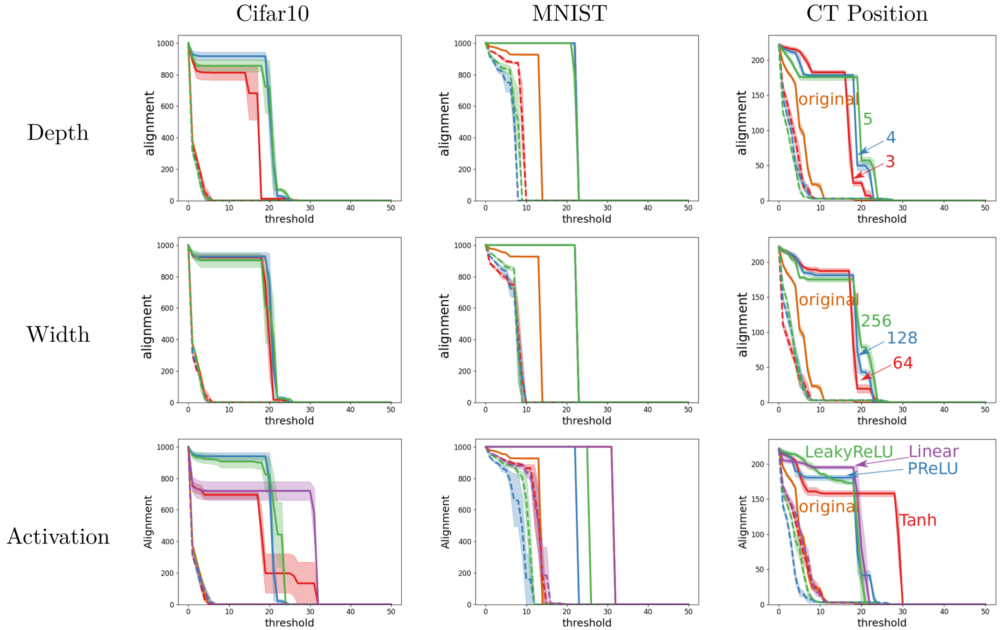, 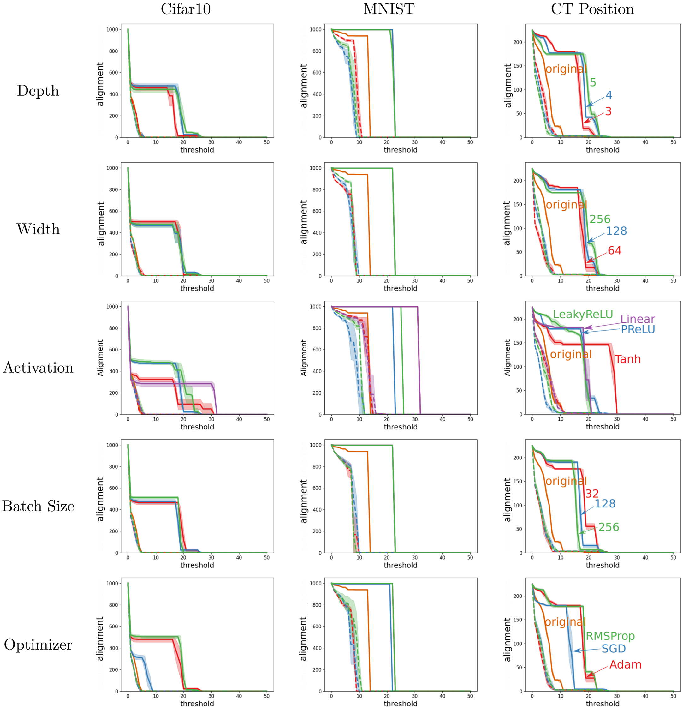, 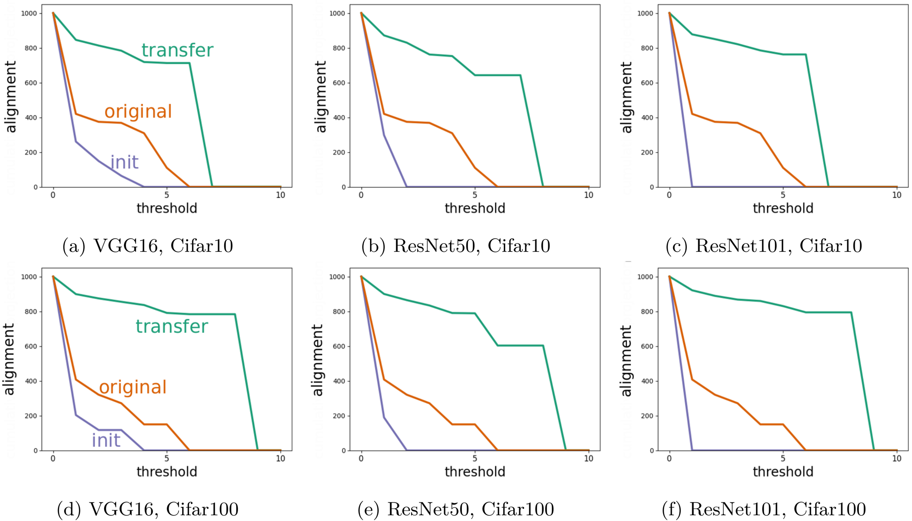
*   **Layer-wise Increase**: Layers closer to the output of a multi-layer network exhibit monotonically higher alignment after training, indicating greater specialization to the task. 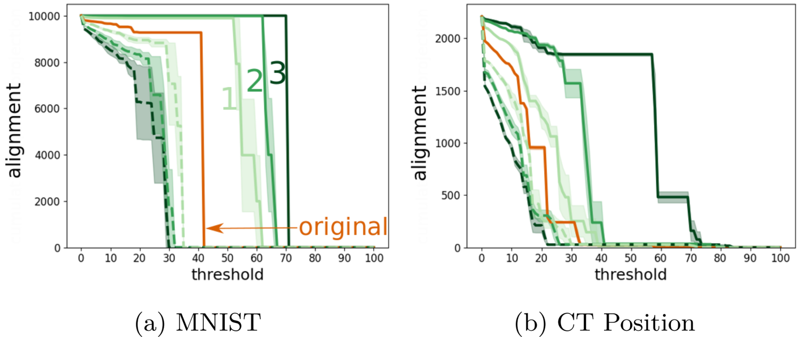
*   **Alignment and Convergence**: Higher alignment directly correlates with faster convergence rates and better generalization (smaller weight magnitudes for similar loss reduction) in subsequent linear models. This is explained by gradient descent's "fast phase" which quickly reduces loss components aligned with large singular values. 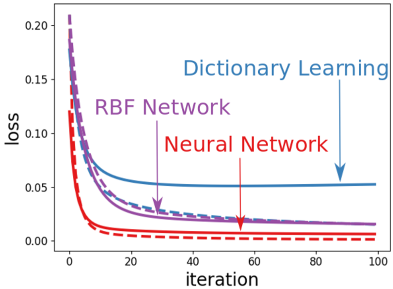, 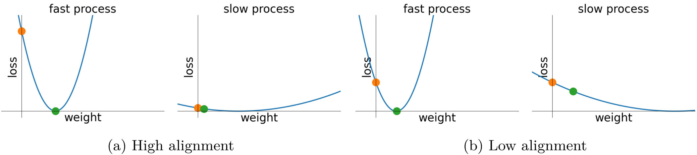, 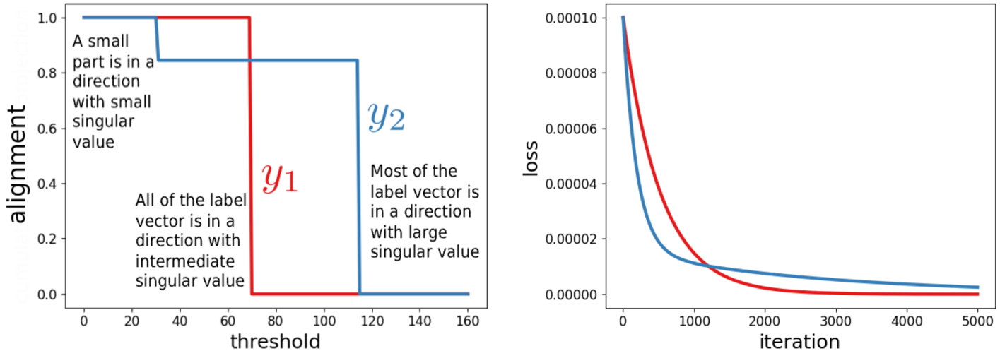, 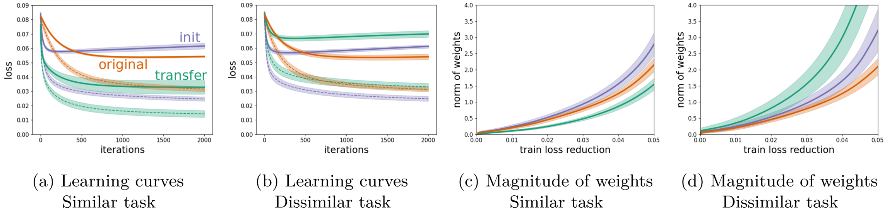
*   **Correlation with Transfer Learning**:
    *   **Positive Transfer**: Training on a source task increases alignment for related target tasks, leading to better transfer performance (faster learning, improved generalization). [Image 10 (a,b)], [Image 11 (a,c)]
    *   **Negative Transfer**: Training on a source task reduces alignment for unrelated target tasks, leading to worse transfer performance (slower learning, larger generalization gap). [Image 10 (c)], [Image 11 (b,d)], 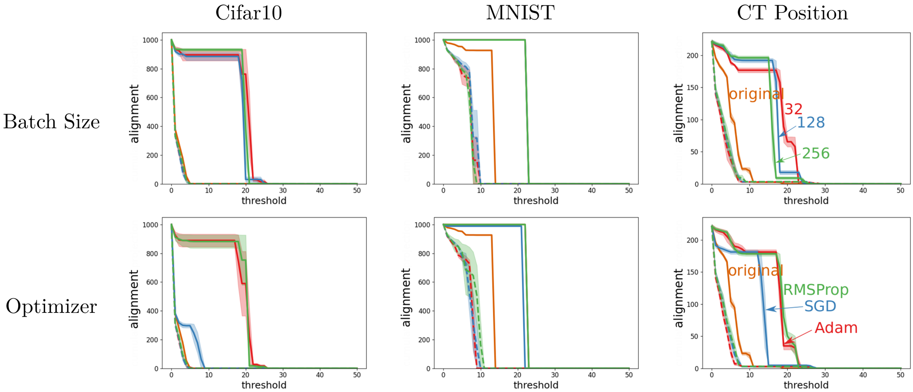
    *   **CNNs for Vision**: Pre-trained CNNs (VGG16, ResNet50/101) exhibit significantly higher alignment on Cifar10/100 than original inputs, randomly initialized networks, RBF, SIFT, or HOG features, resulting in superior transfer learning performance. 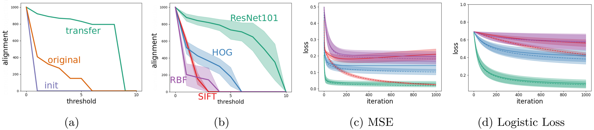, 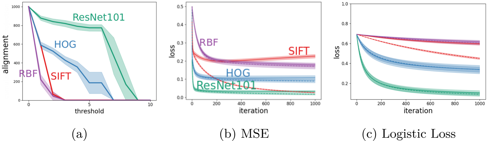, 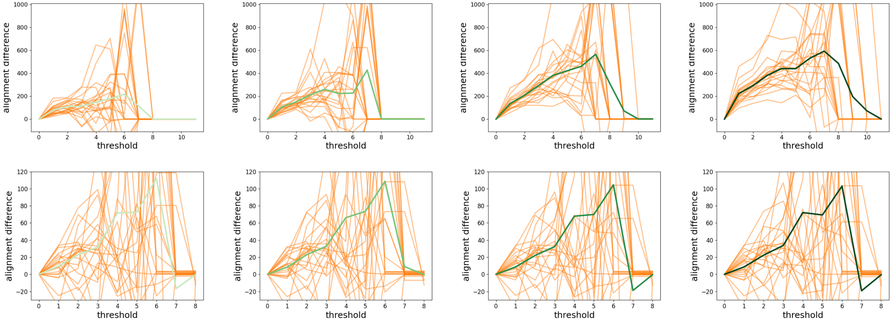
    *   **Task Similarity in Fine-tuning**: Pre-training on source tasks more similar to the target task (e.g., ImageNet-Artificial for Cifar10-Artificial) yields higher alignment and better fine-tuning accuracy. 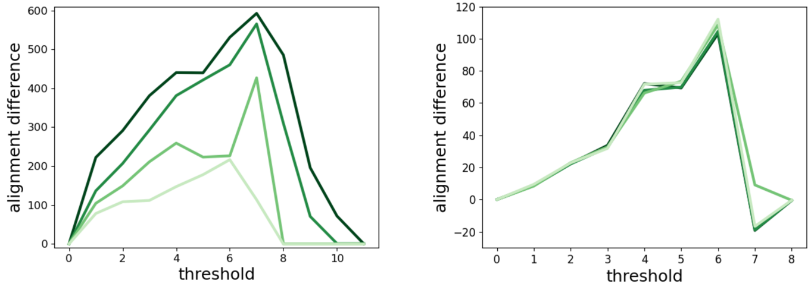

**Quantitative Results**

| Source Task         | Target Task      | Architecture | Transfer Accuracy (%) |
| :------------------ | :--------------- | :----------- | :-------------------- |
| ImageNet-Natural    | Cifar10-Natural  | ResNet18     | 94.55                 |
| ImageNet-Artificial | Cifar10-Natural  | ResNet18     | 90.49                 |
| ImageNet-Natural    | Cifar10-Artificial | ResNet18     | 95.7                  |
| ImageNet-Artificial | Cifar10-Artificial | ResNet18     | 97.14                 |
| ImageNet-Natural    | Cifar10-Natural  | T2T-ViT      | 84.33                 |
| ImageNet-Artificial | Cifar10-Natural  | T2T-ViT      | 83.1                  |
| ImageNet-Natural    | Cifar10-Artificial | T2T-ViT      | 91.0                  |
| ImageNet-Artificial | Cifar10-Artificial | T2T-ViT      | 92.8                  |

*Comparison of multi-class classification test accuracy for fine-tuning on Cifar10 using models pre-trained on different ImageNet splits (Figure 15).*

| Source Domain (Random Labels) | Target Domain | Test Accuracy (%) |
| :---------------------------- | :------------ | :---------------- |
| None                          | DSLR          | 88.0              |
| None                          | Webcam        | 92.5              |
| None                          | Amazon        | 82.7              |
| DSLR                          | Webcam        | 70.3              |
| DSLR                          | Amazon        | 65.6              |
| Webcam                        | DSLR          | 30.7              |
| Webcam                        | Amazon        | 47.3              |
| Amazon                        | DSLR          | 4.7               |
| Amazon                        | Webcam        | 4.6               |

*Test accuracy for ResNet18 on Office-31 showing negative transfer. "None" indicates direct training on the target task without adverse pre-training (Table 1).*

### 4. Core Contribution

The single most significant contribution of this work is the identification, definition, and empirical characterization of **representation alignment** as a fundamental emergent property of neural network training that directly explains their effectiveness in transfer learning. By showing that networks align their top singular vectors to the targets, and that this alignment correlates with improved convergence rates and generalization, the paper provides a novel and quantifiable lens through which to understand and predict positive and negative transfer.

### 5. Open Source Contributions

A demo is available at: [https://github.com/EhsanEI/rep-align-demo](https://github.com/EhsanEI/rep-align-demo)

### 6. Noteworthy Citations

1.  **Arora et al. (2019). Fine-grained analysis of optimization and generalization for overparameterized two-layer neural networks.** This paper is crucial as it lays the theoretical groundwork for understanding how alignment between labels and the eigendirections of the Gram matrix can explain generalization and optimization in overparameterized networks, which the current work adapts and builds upon for hidden representations.
2.  **Oymak et al. (2019a). Generalization guarantees for neural networks via harnessing the low-rank structure of the jacobian.** This work refines the analysis of Arora et al. (2019), particularly focusing on separating large and small eigenvalues and connecting this to the "fast and slow phases" of gradient descent, which is a key explanatory mechanism for alignment's impact on convergence in the current paper.
3.  **Yosinski et al. (2014). How transferable are features in deep neural networks?** This is a seminal empirical paper in transfer learning, showing that features become more specific to the source task in deeper layers. The current paper directly investigates and provides an explanation for these phenomena through the lens of representation alignment in its transfer experiments.