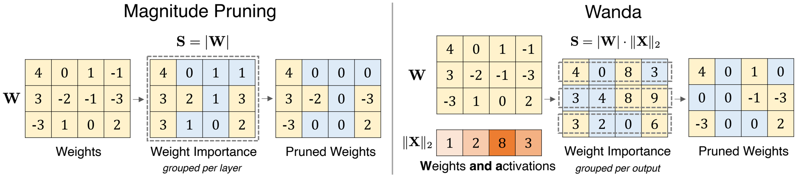
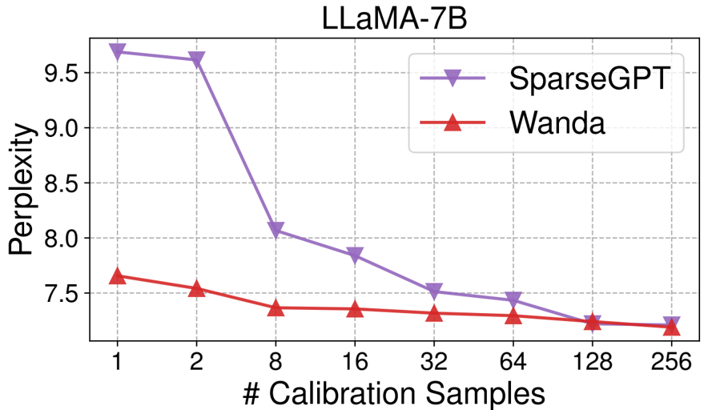

This paper introduces Wanda (Pruning by Weights and activations), a novel and effective pruning method for Large Language Models (LLMs) that operates without retraining or computationally intensive weight updates.

### 1. Problem Statement

Large Language Models (LLMs), with their billions of parameters, require significant computational resources, hindering their accessibility and deployment. While network pruning is a common compression technique, existing methods typically demand expensive retraining or complex iterative weight updates, which are prohibitive for billion-scale LLMs. Standard magnitude pruning, successful in smaller networks, fails dramatically on LLMs even at low sparsity levels. The core problem is to develop a straightforward, computationally efficient pruning approach for pretrained LLMs that preserves performance without the need for additional training or complex weight reconstruction.

### 2. Methodology

Wanda proposes a simple yet effective pruning approach motivated by the observation of emergent large magnitude features in LLMs. It consists of two main components:

1.  **Pruning Metric**: For each weight $W_{ij}$ in a linear layer, its importance is evaluated by the product of its magnitude and the $L_2$ norm of the corresponding input activations: $|W_{ij}| \cdot \|X_j\|_2$. This metric explicitly accounts for the input activations' scale, which is crucial given the "emergent large magnitude features" observed in LLMs. The input activation norms are estimated using a small set of calibration data.  illustrates this metric compared to magnitude pruning.
2.  **Comparison Group**: Unlike traditional layer-wise or global comparisons, Wanda prunes weights on a "per-output basis." This means weights are compared locally within each output neuron (i.e., within each row of the weight matrix). The paper finds this per-output grouping to be consistently superior for LLMs, even for standard magnitude pruning, suggesting the importance of maintaining a balanced pruning ratio across output features.

The Wanda procedure is computationally efficient, requiring only a single forward pass of the LLM to compute the pruning metrics sequentially from the initial to final layers. It requires no weight updates or iterative processes, making it significantly faster than methods like SparseGPT. The method can also be extended to structured N:M sparsity patterns by comparing weights within every M consecutive weights connected to an output. The PyTorch implementation is straightforward as shown in Algorithm 1 within the paper.

### 3. Key Results & Analysis

Wanda was evaluated on LLaMA and LLaMA-2 model families across zero-shot tasks and language modeling (WikiText perplexity), using unstructured, 4:8, and 2:4 sparsities.

Here are key quantitative results:

| Metric (Lower is Better for Perplexity, Higher for Accuracy) | Model (Sparsity) | Dense (0%) | Magnitude (50%) | SparseGPT (50%) | Wanda (50%) |
| :--------------------------------------------------------- | :--------------- | :--------- | :-------------- | :-------------- | :---------- |
| **Mean Zero-Shot Accuracy (%)**                             | LLaMA-7B (Unstructured) | 59.99      | 46.94           | 54.94           | 54.21       |
|                                                            | LLaMA-13B (Unstructured) | 62.59      | 47.61           | 58.61           | 59.33       |
|                                                            | LLaMA-2-70B (Unstructured) | 67.08      | 60.93           | 67.28           | 67.03       |
| **WikiText Perplexity**                                    | LLaMA-7B (Unstructured) | 5.68       | 17.29           | 7.22            | 7.26        |
|                                                            | LLaMA-13B (Unstructured) | 5.09       | 20.21           | 6.21            | 6.15        |
|                                                            | LLaMA-2-70B (Unstructured) | 3.12       | 4.98            | 3.98            | 3.98        |

Further analysis reveals:

*   **Performance Comparison**: Wanda significantly outperforms magnitude pruning across all evaluated models and sparsity types. It performs competitively against SparseGPT, often matching or slightly surpassing it, particularly for larger models and unstructured sparsity (e.g., LLaMA-2-70B 50% unstructured perplexity: SparseGPT 3.98, Wanda 3.98).
*   **Computational Efficiency**: Wanda's pruning metric computation is drastically faster than SparseGPT. For LLaMA-65B, Wanda takes 5.6 seconds, while SparseGPT takes 1353.4 seconds (Table 4), representing a 300x speedup in metric computation.
*   **Inference Speedup**: Structured 2:4 sparsity with Wanda provides noticeable inference speedups (e.g., 1.6x for linear layers in LLaMA-65B, Table 5).
*   **Fine-tuning**: Limited fine-tuning (LoRA or full parameter) can significantly recover performance. For example, unstructured 50% sparse LLaMA-7B improved from 54.21% to 58.15% zero-shot accuracy with full fine-tuning (Table 6).
*   **Pruning Configuration (Ablation)**: The "per-output" comparison group is crucial for LLMs. Even for magnitude pruning, using "per-output" significantly improved performance compared to "per-layer" (e.g., LLaMA-7B 50% unstructured magnitude pruning perplexity: per-layer 17.29, per-output 13.41, Table 7).
*   **Robustness to Calibration Samples**: Wanda is more robust to a smaller number of calibration samples than SparseGPT. It performs well even with a single calibration sample (perplexity 7.66 for LLaMA-7B, Figure 2). 
*   **Weight Update**: For Wanda's pruning metric and comparison group, introducing weight updates (sequential or iterative) offers little to no improvement, suggesting that effective sparse subnetworks exist *exactly* as is in pretrained LLMs (Table 8).
*   **Image Classifiers**: On image classification tasks (ConvNeXt, DeiT), "per-layer" pruning was slightly better than "per-output" (Figure 3), highlighting that the "per-output" benefit is specific to LLMs. Wanda's metric still outperformed magnitude pruning on image classifiers (Figure 4).

### 4. Core Contribution

The single most significant contribution of this work is the introduction of Wanda, a novel, simple, and highly effective pruning method for large language models that **requires no retraining or weight updates**. It achieves competitive performance with more complex, computationally intensive methods like SparseGPT by intelligently leveraging the emergent large magnitude features unique to LLMs through a new pruning metric ($|W_{ij}| \cdot \|X_j\|_2$) and a crucial "per-output" comparison grouping strategy. This demonstrates the existence of effective sparse subnetworks *within* pretrained LLMs that can be discovered efficiently.

### 5. Open Source Contributions

The authors mention that the code for Wanda is publicly available.
*   **Code**: https://github.com/locuslab/wanda

### 6. Noteworthy Citations

1.  **Frantar & Alistarh, 2023. SparseGPT: Massive language models can be accurately pruned in one-shot.** This is the direct state-of-the-art baseline method that Wanda competes against, especially regarding its computational cost and the need for weight updates.
2.  **Dettmers et al., 2022. LLM.int8(): 8-bit matrix multiplication for transformers at scale.** This paper's observation of emergent large magnitude features in LLMs directly motivated Wanda's novel pruning metric, providing crucial insight into LLM behavior relevant to compression.
3.  **Han et al., 2015. Learning both weights and connections for efficient neural networks.** This paper established magnitude pruning, a fundamental and strong baseline that Wanda significantly outperforms in the LLM context, highlighting the limitations of traditional methods for these large models.