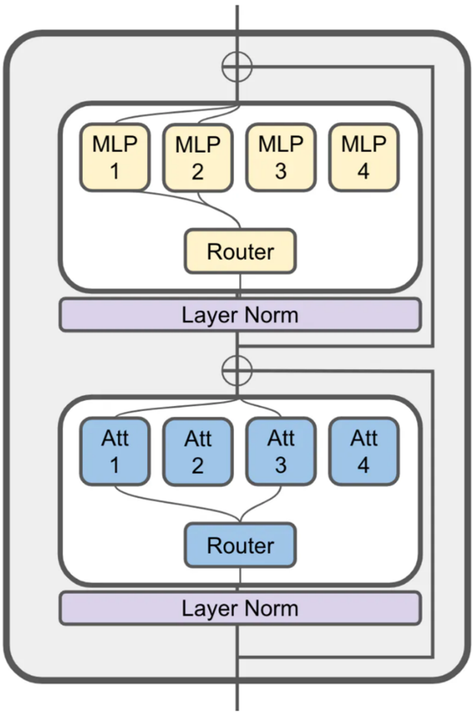
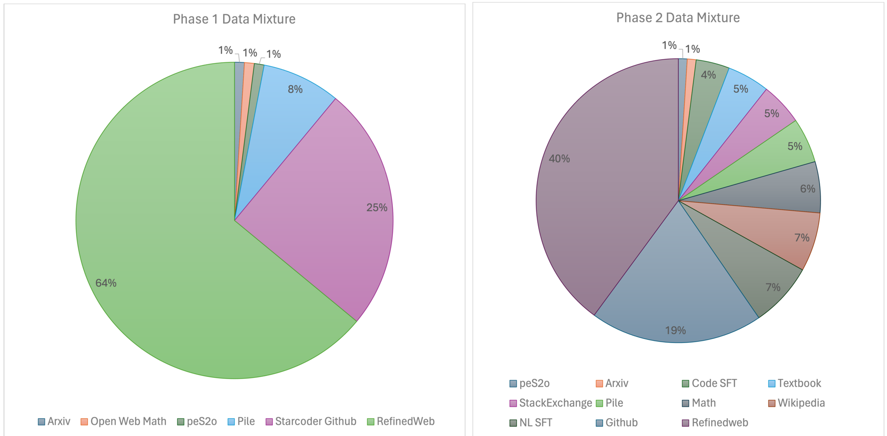
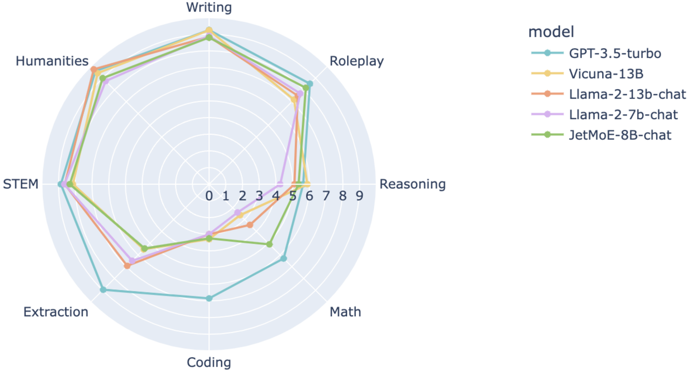

## JetMoE: Reaching Llama2 Performance with 0.1M Dollars

### Problem Statement

The increasing resource demands of Large Language Models (LLMs) pose a significant obstacle to developing powerful and accessible AI. Most state-of-the-art LLMs are "dense models," activating all their parameters during training and inference, which is computationally expensive and inefficient. While Mixture-of-Experts (MoE) architectures offer a solution for parameter scaling with modest computational costs, many successful commercial MoE models lack transparency regarding their training recipes and use proprietary datasets, hindering open-source community efforts. Existing open-source MoE models, like OpenMoE, often lag in performance compared to dense models with similar activated parameters. The core problem is the high cost and lack of openness in training high-performing LLMs, particularly MoE models, making them inaccessible to broader research communities.

### Methodology

JetMoE-8B introduces an efficient Sparsely-gated Mixture-of-Experts (SMoE) architecture. The key methodological innovations are:

1.  **Dual Sparse Activation**: Unlike prior MoE models that primarily apply sparse activation to only the feed-forward layers, JetMoE-8B extends this concept to *both* the attention and feed-forward layers. This design, inspired by ModuleFormer, further reduces computational costs while maintaining performance.
    
    *Figure 1: JetMoE architecture illustrates sparse activation in both MLP and Attention layers.*

2.  **Shared Key/Value Projections in Attention Experts**: Within the Mixture of Attention heads (MoA) architecture, while query and output projection matrices are expert-specific, the key (`Wk`) and value (`Wv`) projection matrices are shared across attention experts. This sharing aims to improve training stability and efficiency.

3.  **Load Balancing**: To ensure efficient utilization of all experts and prevent a few from dominating, JetMoE-8B incorporates two load balancing losses during pretraining:
    *   Frequency-based auxiliary loss (Fedus et al., 2021)
    *   Router z-loss (Zoph et al., 2022)
    These losses are weighted (α=0.01, β=0.001) and added to the main training loss.

4.  **Cost-Effective Pretraining**: The model was trained with a limited budget of less than $0.1 million, utilizing 1.25 trillion tokens from carefully mixed open-source corpora and 30,000 H100 GPU hours. The training employed a two-phase data mixture strategy:
    *   **Phase 1 (Warmup & Stable Learning Rate)**: Focused on general web, code, and mathematical datasets (RefinedWeb, Starcoder, The Pile, Dolma peS2o, OpenWebMath).
    *   **Phase 2 (Decay Learning Rate)**: Increased the weight of high-quality data and included additional high-quality datasets like xP3x, OpenAssistant, UltraTextbooks, and various SFT and mathematical datasets.
    
    *Figure 2: Pretraining data mixture across Phase 1 and Phase 2, illustrating the shift towards higher-quality data.*

5.  **Alignment**: The base model (JetMoE-8B) was aligned using a two-stage process:
    *   **Distilled Supervised Fine-Tuning (dSFT)**: Trained on a combination of diverse instruction-following datasets generated by teacher models (e.g., UltraChat 200k, Airoboros-3.2).
    *   **Distilled Direct Preference Optimization (dDPO)**: Further fine-tuned using the UltraFeedback dataset, leveraging binary preference labels from an aligned teacher model to optimize a reward function.

6.  **Infrastructure & Hyperparameters**: Training used Megatron with Megablock for MoE support, further modified for MoA and z-loss. Pipeline parallelism was chosen over expert parallelism for efficiency due to the dropless MoE schema. The model has 8B total parameters, activating 2B per token, with 24 layers, a model dimension of 2048, 8 experts (top-k=2), 16 KV heads, a head dimension of 128, and an MLP dimension of 5632.

### Key Results & Analysis

JetMoE-8B demonstrates impressive performance, often surpassing larger and more resource-intensive models despite its low training cost and computational efficiency.

**Quantitative Results:**

| Model                      | # Total Params | # Active Params | # Training tokens | ARC-challenge | Hellaswag | MMLU | TruthfulQA | WinoGrande | GSM8k | OpenLLM Leaderboard Avg. | MBPP (Pass@1) | HumanEval (Pass@1) | All Avg. |
| :------------------------- | :------------- | :-------------- | :---------------- | :------------ | :-------- | :--- | :--------- | :--------- | :---- | :----------------------- | :------------ | :----------------- | :------- |
| LLaMA2-7B                  | 7B             | 7B              | 2T                | 53.1          | 78.6      | 46.9 | 38.8       | 74.0       | 14.5  | 51.0                     | 20.8          | 12.8               | 45.5     |
| DeepseekMoE-16B            | 16B            | 2.8B            | 2T                | 53.2          | 79.8      | 46.3 | 36.1       | 73.7       | 17.3  | 51.1                     | 34.0          | 25.0               | 47.3     |
| Gemma-2B                   | 2B             | 2B              | 2T                | 48.4          | 71.8      | 41.8 | 33.1       | 66.3       | 16.9  | 46.4                     | 28.0          | 24.4               | 43.2     |
| **JetMoE-8B**              | **8B**         | **2.2B**        | **1.25T**         | **48.7**      | **80.5**  | **49.2** | **41.7**   | **70.2**   | **27.8** | **53.0**                | **34.2**     | **14.6**           | **47.6** |

**Chat Model Performance (MT-Bench):**

| Model            | MT-Bench Score |
| :--------------- | :------------- |
| GPT-4            | 9.014          |
| GPT-3.5-turbo    | 7.995          |
| Claude-v1        | 7.923          |
| **JetMoE-8B-chat** | **6.681**      |
| Llama-2-13b-chat | 6.65           |
| Vicuna-13b-v1.3  | 6.413          |
| Wizardlm-13b     | 6.353          |
| Llama-2-7b-chat  | 6.269          |

**Analysis:**
*   **Cost-Effectiveness & Performance**: JetMoE-8B, trained with less than $0.1 million and 1.25T tokens, outperforms Llama2-7B and achieves a higher average score on the OpenLLM Leaderboard (53.0 vs. 51.0 for Llama2-7B). JetMoE-8B-Chat also surpasses Llama2-13B-Chat (6.681 vs. 6.65 MT-Bench score), demonstrating that high performance can be achieved with significantly reduced costs.
*   **Efficiency**: With 8B total parameters, JetMoE-8B only activates 2.2B parameters per input token, reducing inference computation by approximately 70% compared to Llama2-7B.
*   **Specific Strengths**: JetMoE-8B shows strong performance in Hellaswag, MMLU, TruthfulQA, and especially in mathematical reasoning (GSM8k) and Python programming (MBPP Pass@1), where it achieved the highest scores among compared models.
*   **Limitations**: As illustrated by the MT-Bench radar chart, JetMoE-8B-Chat is relatively weaker in coding and extraction tasks compared to GPT-3.5-turbo. This is attributed to its smaller active parameter size potentially leading to suboptimal reasoning capabilities in these complex domains.
    
    *Figure 3: MT-Bench radar figure shows JetMoE-8B-Chat's balanced performance, with relative weaknesses in coding and extraction compared to GPT-3.5-turbo.*

### Core Contribution

The single most significant and novel contribution of this work is demonstrating that high-performance LLM training can be achieved in a **highly cost-effective and open-source manner** by leveraging a novel Sparsely-gated Mixture-of-Experts (SMoE) architecture with **sparse activation applied to *both* attention and feed-forward layers**, alongside a carefully curated open-source data mixture. This approach leads to impressive results, with JetMoE-8B outperforming Llama2-7B and JetMoE-8B-Chat surpassing Llama2-13B-Chat, all while significantly reducing computational costs (70% less inference computation than Llama2-7B) and maintaining full transparency.

### Open Source Contributions

The authors have made several key open-source contributions:

*   **Model Release**: The JetMoE models are publicly available.
    *   Link: `https://github.com/myshell-ai/JetMoE`
*   **Training Code**: Only open-source training code was used and is implied to be made available.
*   **Public Datasets**: Training exclusively used public datasets, and their detailed mixtures are provided in the report.
*   **Transparency**: All training parameters and data mixtures have been meticulously detailed within the report to facilitate reproducibility and future research.
*   **Alignment Framework**: The alignment process leverages the open-source Alignment Handbook (`https://github.com/huggingface/alignment-handbook`).

### Noteworthy Citations

1.  **Shazeer et al., 2017. *Outrageously large neural networks: The sparsely-gated mixture-of-experts layer.***: This is a foundational paper on Sparse Mixture-of-Experts, which JetMoE builds upon.
2.  **Shen et al., 2023. *Moduleformer: Learning modular large language models from uncurated data.***: Directly cited as inspiration for JetMoE's architecture, particularly the concept of extending sparse activation to both attention and feed-forward layers.
3.  **Touvron et al., 2023. *Llama: Open and efficient foundation language models.***: Llama2 models serve as the primary benchmark for comparison, making this a critical reference for understanding the performance context.