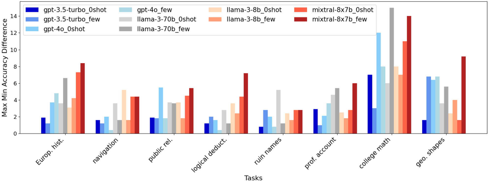
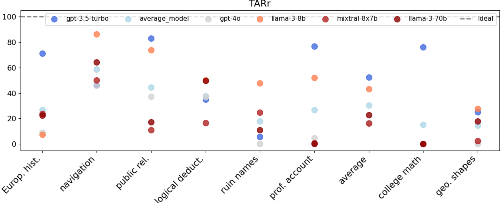
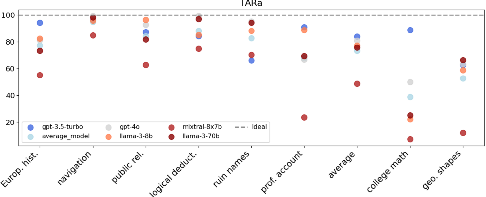
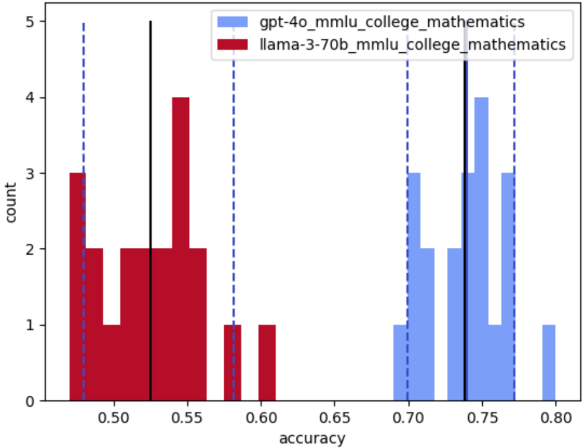
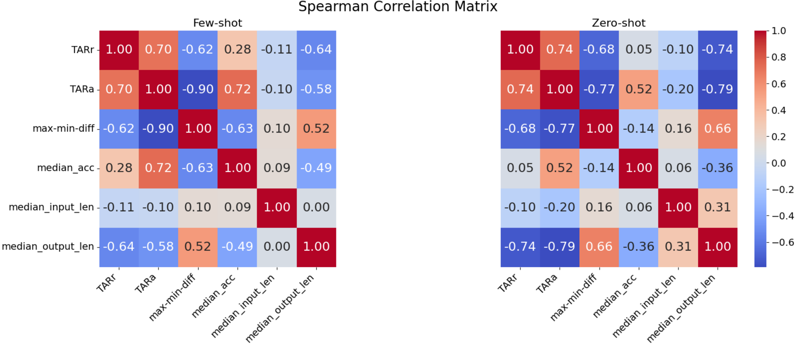

## Non-Determinism of 'Deterministic' LLM Settings: A Detailed Summary

### 1. Problem Statement

LLM practitioners frequently observe variations in model outputs despite using settings (e.g., `temperature=0`) that are theoretically designed for deterministic behavior. The core problem this paper addresses is the lack of systematic investigation into the pervasiveness and impact of this non-determinism on LLM results. Current benchmarks often report single accuracy scores without accounting for this inherent variability, which undermines their validity and complicates robust engineering for real-world applications.

### 2. Methodology

The authors conducted a systematic investigation into LLM non-determinism using five top-performing models across different families and sizes: GPT-3.5 Turbo, GPT-4o, Llama-3-70B-Instruct, Llama-3-8B-Instruct, and Mixtral-8x7B-Instruct.

Eight diverse multiple-choice tasks were selected from two widely used benchmarks:
*   **BIG-Bench Hard (BBH)**: Navigation, Ruin Names, Geometric Shapes, Logical Deduction (3 objects).
*   **Massive Multitask Language Understanding (MMLU)**: H. S. Europ. Hist., College Math, Prof. Accounting, Public Rel.

Experiments were performed under maximally deterministic hyper-parameter settings: `temperature=0`, `top-p=1`, and a fixed random seed. Each model-task combination was tested in both zero-shot and few-shot (3-shot for BBH, 5-shot for MMLU) configurations, with 10 identical runs per condition.

To quantify instability, the authors introduced two primary metrics:
*   **TARr@N (Total Agreement Rate at N runs for raw output)**: The percentage of test set questions where the raw LLM string responses were identical across N runs.
*   **TARa@N (Total Agreement Rate at N runs for parsed answer)**: The percentage where the extracted, parsed answers were identical across N runs, allowing for variations in output format.

Additional metrics included:
*   **BestAcc**: Maximum possible accuracy achieved across N runs (if at least one run was correct, it counts as correct).
*   **WorstAcc**: Minimum possible accuracy across N runs (if at least one run was incorrect, it counts as incorrect).
*   **Median accuracy**: The median accuracy observed over N runs.
*   **Maximum-minimum accuracy difference**: The difference between the highest and lowest accuracy scores recorded in N runs.

### 3. Key Results & Analysis

The study revealed a significant and pervasive degree of non-determinism in LLMs, even under supposedly deterministic settings.

*   **Accuracy Variation**: Outputs varied considerably, with accuracy differences up to 15% across 10 runs for the same inputs and settings, as shown in . The gap between the best and worst possible performance (BestAcc to WorstAcc) could be as high as 72% for specific tasks and models (e.g., Mixtral-8x7b on college math, few-shot).
*   **Lack of Consistent Repeatability**: None of the five LLMs consistently delivered repeatable accuracy or identical output strings across all tasks.
*   **Raw vs. Parsed Output Stability**: TARr@10 scores were generally low, indicating widespread string-level variations. TARa@10 scores were significantly higher but still far from 100%, demonstrating that even the parsed answers are not consistently stable. For instance, Mixtral-8x7b on college math (few-shot) showed 0.0% TARr@10 and only 7.0% TARa@10.  and  illustrate the varied TARr@10 and TARa@10 across models and tasks, highlighting task-specific instability.
*   **Non-Normal Distribution**: The distribution of accuracy scores across multiple runs was found to be non-normal, with means and medians often far from the mode, as exemplified by GPT-4o and Llama-3-70b on college math . This complicates the use of standard deviation for quantifying uncertainty.
*   **Correlation Analysis**:
    *   A strong to moderate negative correlation was observed between output length and both TARa@10 and TARr@10 in both few-shot and zero-shot settings. This implies that as an LLM's output length increases, its output becomes more unstable.
    *   Output length also showed a positive correlation with the maximum-minimum accuracy difference, further supporting the link between longer outputs and increased instability .
    *   In the few-shot setting, a strong positive correlation was found between median accuracy and TARa@10, suggesting that more accurate LLMs tend to be more deterministic in their multiple-choice selections.
    *   Conversely, a moderate negative correlation existed between output length and median accuracy, indicating that restricting max generation tokens might improve both determinism and accuracy.

The table below summarizes some key quantitative results demonstrating LLM instability:

| Metric                                            | Model/Task/Setting               | Value     | Description                                                                                                                              |
| :------------------------------------------------ | :------------------------------- | :-------- | :--------------------------------------------------------------------------------------------------------------------------------------- |
| Max-Min Acc Difference                            | Mixtral-8x7b, College Math, Few-shot | ~14%      | Highest observed percentage difference between maximum and minimum accuracy across 10 runs ().                                  |
| Performance Gap (BestAcc vs. WorstAcc)          | Mixtral-8x7b, College Math, Few-shot | 72% (75.0% vs. 3.0%) | Largest observed disparity between the best and worst possible accuracy extracted from 10 runs (Table 2).                                |
| TARr@10 (Raw Output Agreement Rate)               | Mixtral-8x7b, College Math, Few-shot | 0.0%      | Raw outputs were entirely non-repeatable for this specific condition over 10 runs (Table 2).                                             |
| TARa@10 (Parsed Answer Agreement Rate)            | Mixtral-8x7b, College Math, Few-shot | 7.0%      | Even after parsing, answers showed significant non-repeatability for this condition over 10 runs (Table 2).                              |
| TARa@10 (Parsed Answer Agreement Rate)            | GPT-4o, College Math, Few-shot   | 50.0%     | Demonstrates moderate repeatability for parsed answers under similar high-instability conditions (Table 2).                              |
| Max-Min Acc Difference                            | GPT-4o, College Math, Few-shot   | 44% (88.0% vs. 44.0%) | Significant performance gap, illustrating common variability even in high-performing models (Table 2). |
| TARr@10 (Raw Output Agreement Rate)               | GPT-3.5-turbo, Navigation, Few-shot | 46.0%     | An example where raw output has moderate repeatability, despite low accuracy difference (Table 2).                                       |

### 4. Core Contribution

The most significant contribution of this work is its **systematic and quantitative investigation into the non-determinism of LLMs under explicitly deterministic settings.** By introducing novel metrics like TARr@N and TARa@N, the paper provides a much-needed framework to quantify and analyze this overlooked aspect of LLM behavior. It rigorously demonstrates that "deterministic" LLM settings do not guarantee consistent outputs or accuracy, severely impacting the reliability of benchmark evaluations and posing significant challenges for practical engineering applications.

### 5. Open Source Contributions

The authors have made their code and data publicly available to facilitate further research and reproducibility.
**GitHub Repository:** https://github.com/breckbaldwin/llm-stability

### 6. Noteworthy Citations

1.  **Hendrycks et al., 2021 (Measuring massive multitask language understanding)**: This paper introduces the MMLU benchmark, a key dataset used in the current study for evaluating LLMs across diverse tasks.
2.  **Suzgun et al., 2023 (Challenging BIG-bench tasks and whether chain-of-thought can solve them)**: This work introduces the BIG-Bench Hard (BBH) benchmark, another critical dataset used for assessing LLM capabilities in complex reasoning tasks within the paper.
3.  **Brown et al., 2020 (Language models are few-shot learners)**: A foundational paper introducing GPT-3 and the concept of few-shot learning, which is a core prompting strategy utilized in the experiments of this study (e.g., GPT-3.5 Turbo is one of the models tested).