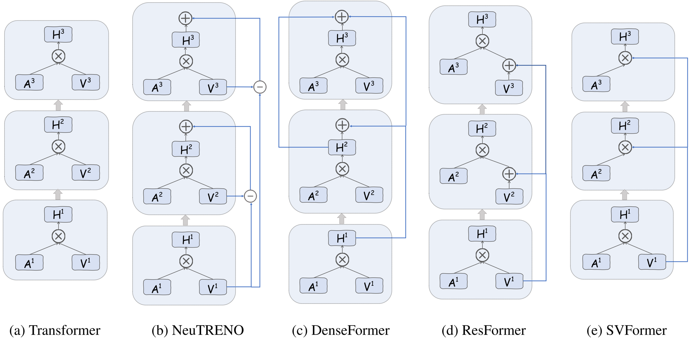
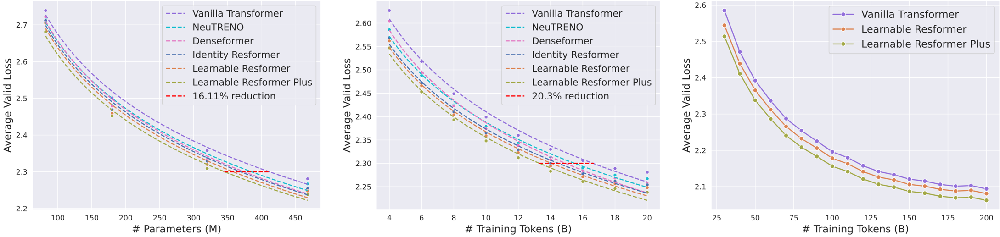
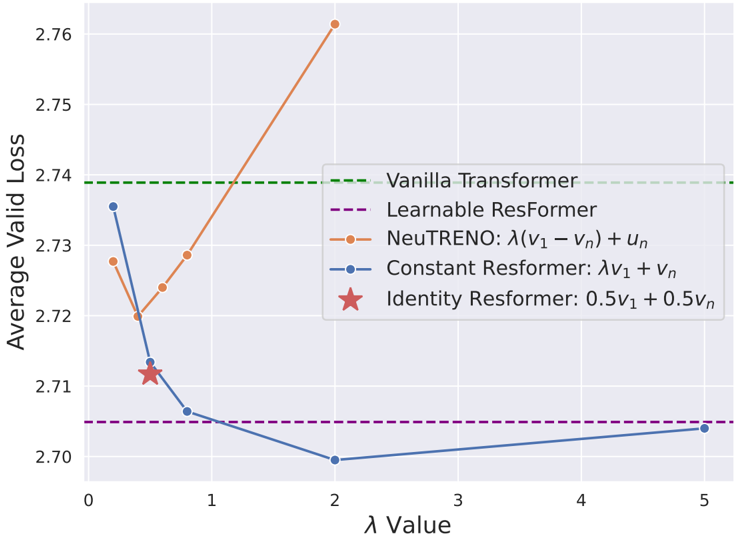

## Value Residual Learning: ResFormer and SVFormer

### 1. Problem Statement

The paper addresses the critical challenge of effective information propagation in deep Transformer networks. Standard hidden state residual connections often fail to adequately preserve initial token-level information in deeper layers due to the attention mechanism's smoothing effect, leading to "over-smoothing" where token representations become increasingly similar. This results in the dilution of token-level features and the dominance of sequence-level features in deeper layers, potentially hindering the modeling of abstract semantic information. Furthermore, large Transformer models face substantial KV cache requirements during inference, severely impacting deployment efficiency.

### 2. Methodology

The authors propose two novel architectures: ResFormer and SVFormer.

*   **ResFormer**: This architecture enhances information flow by introducing **value residual connections** in addition to the standard hidden state residuals. Specifically, for each layer `n`, ResFormer modifies the value vector `V_n` by incorporating the value vector from the first layer `V_1` before the attention operation (Equation 5): `V'n = λ_n,1 * V_1 + λ_n,2 * V_n`. This allows later layers to directly access the raw, token-level information from the initial embedding, complementing the existing hidden state residuals. The paper explores various forms:
    *   **Constant-ResFormer**: `λ_n,1` and `λ_n,2` are predetermined constants.
    *   **Identity-ResFormer**: `λ_n,1 = λ_n,2 = 0.5` for all layers.
    *   **Sparse-ResFormer**: `λ_n,1 = 0` for some layers, selectively applying the value residual.
    *   **Learnable-ResFormer**: `λ_n,1` and `λ_n,2` are trainable parameters, initialized to 0.5.
    *   **Learnable ResFormer Plus**: A variant with a specific initialization strategy for `λ_n,1` and `λ_n,2` to allow later layers to require more supplementary information from `V_1`.
    *   **Dense-ResFormer**: A more general form where `V_n` can be a weighted sum of all preceding value vectors.
    A simplified illustration of ResFormer's connections compared to other models is shown in .

*   **SVFormer**: Building on ResFormer, SVFormer aims to reduce KV cache size. It adopts standard attention in the first layer, but for subsequent layers (`n ≥ 2`), it computes the attention output `U_n = A_n V_1`. This means all layers share a single value state, specifically that of the first layer. This design significantly reduces the need to compute and store value vectors for every layer, leading to nearly half the KV cache size during inference. SVFormer is also illustrated in .

### 3. Key Results & Analysis

The experiments were conducted on a 20B SlimPajama subsampled dataset using Llama-like architectures.

**Quantitative Results Table:**

| Metric / Model             | Vanilla Transformer | NeuTRENO | DenseFormer | Identity ResFormer | Learnable ResFormer | Learnable ResFormer Plus | SVFormer (vs. Transformer) |
| :------------------------- | :------------------ | :------- | :---------- | :----------------- | :------------------ | :----------------------- | :------------------------- |
| **Equivalent Loss**        |                     |          |             |                    |                     |                          |                            |
| Parameters Reduction       | -                   | -        | -           | -                  | **16.11% fewer**    | -                        | **12.2% more**             |
| Training Data Reduction    | -                   | -        | -           | -                  | **20.3% less**      | -                        | -                          |
| **Validation Loss**        |                     |          |             |                    |                     |                          |                            |
| (468M params, 20B tokens)  | 2.275               | 2.295    | 2.285       | 2.28               | 2.27                | **2.25**                 | 2.40 (for ~300M equiv.)    |
| (82M params, 8-layer)      | 2.739               | 2.72     | 2.722       | 2.712              | 2.705               | **2.681**                | -                          |
| Best Sparse-ResFormer Loss | -                   | -        | -           | -                  | -                   | -                        | 2.687 (5*V1+Vn, layers 6-8)|
| **Downstream Avg. Accuracy** |                     |          |             |                    |                     |                          |                            |
| (468M params, 20B tokens)  | 40.6                | 41.4     | 40.8        | 41.3               | **42.3**            | 42.0                     | -                          |
| **KV Cache Reduction (SVFormer)** | -                   | -        | -           | -                  | -                   | -                        | **~50%**                   |

**Key Findings:**
*   **ResFormer Performance**: ResFormer variants consistently outperform vanilla Transformer, NeuTRENO, and DenseFormer.  demonstrates that ResFormer achieves equivalent validation loss with significantly fewer parameters and less training data. Table 2 shows improved average accuracy on downstream tasks.
*   **`λ` Value Sensitivity**: Constant-ResFormer is more robust to varying `λ` values and outperforms NeuTRENO. 
*   **Ablation Studies**:
    *   Only skip-connections originating from the first layer's value (`V_1`) yield significant performance improvements (Fig. 5 Left, Table 5). Later layers (e.g., 6-8) benefit most from `V_1` connections (Fig. 5 Right).
    *   Learned `λ` values in Learnable-ResFormer confirm that later layers tend to require more `V_1` input (Fig. 6).
    *   Value residual connections (`V_1` to `V_n`) are superior to additional hidden residuals (`H_0` to `H_n`) or residuals to query, key, or attention states (Table 4, Table 6). Sharing the current layer's attention matrix for the `V_1` residual yields the best performance (Table 7).
*   **ResFormer Mechanism**: Post-analysis shows ResFormer maintains high similarity between `V_1` and subsequent post-residual values, suggesting `W_V` in deeper layers learns the value residual. Pre-residual values in ResFormer layers become increasingly similar as the network deepens (Fig. 8). ResFormer's attention contributes more significantly to hidden states, and its hidden states have higher information density (Fig. 9). ResFormer significantly mitigates attention concentration effects like attention sinks, value-state drains, and hidden-state peaks (Fig. 13, Fig. 14, Fig. 15).
*   **SVFormer Performance**: SVFormer reduces KV cache by nearly half. While it requires a 12.2% increase in parameters to match Transformer's validation loss (Fig. 11), its performance is strongly influenced by training sequence length, performing better with longer sequences (Fig. 10 Left). The "critical point" where vanilla Transformer overtakes SVFormer shows an exponential relationship with sequence length (Fig. 10 Right). SVFormer can be integrated with other KV-efficient methods like GQA for further reductions (Table 8). It also benefits more from smaller learning rates (Table 9).

### 4. Core Contribution

The most significant and novel contribution of this work is the introduction of **value residual connections** in ResFormer, specifically linking the first layer's value vector (`V_1`) to subsequent layers' value computations. This novel shortcut effectively addresses the problem of information degradation in deep Transformers by ensuring initial token-level information propagates more robustly to deeper layers, leading to significant performance gains (fewer parameters, less data) and alleviating issues like over-smoothing and attention concentration. Additionally, the derived **SVFormer** provides a practical method for nearly halving KV cache size by having all layers share the first layer's value embedding, a crucial advancement for efficient large language model inference.

### 5. Open Source Contributions

The paper mentions the use of:
*   **SlimPajama** (Soboleva et al., 2023) dataset for main experiments.
*   **Tokenizer** used for 'RedPajama-INCITE-7B-Base'.
No specific code repositories or model weights are explicitly mentioned as open-source contributions from the authors for ResFormer or SVFormer.

### 6. Noteworthy Citations

1.  **Vaswani et al., 2017. Attention Is All You Need.** (The foundational Transformer paper.)
2.  **He et al., 2016. Deep Residual Learning for Image Recognition.** (Introduced residual connections, a core concept underlying ResFormer.)
3.  **Nguyen et al., 2023. Mitigating Over-smoothing in Transformers via Regularized Nonlocal Functionals.** (A direct competitor, NeuTRENO, also addressing over-smoothing through value vectors, providing context for ResFormer's distinct approach.)
4.  **Kaplan et al., 2020. Scaling Laws for Neural Language Models.** (Provides the theoretical and empirical context for model scaling and the pursuit of larger, deeper models, which ResFormer aims to make more efficient.)