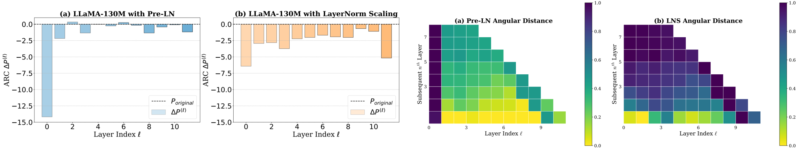
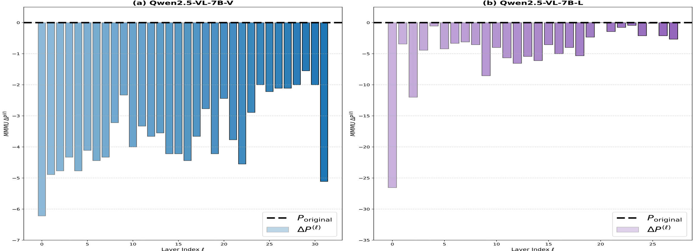

## The Curse of Depth in Large Language Models

### 1. Problem Statement

The paper introduces "The Curse of Depth" (CoD), an observed phenomenon in modern Large Language Models (LLMs) where deeper layers (nearly half of them) are significantly less effective than expected. These deeper layers often contribute minimally to learning and representation, exhibit remarkable robustness to pruning and perturbations, and fail to perform meaningful transformations. This behavior leads to resource inefficiency, as vast computational resources are expended training layers that do not contribute effectively. The root cause is identified as the widespread use of Pre-Layer Normalization (Pre-LN), which, while stabilizing training, causes the output variance to grow exponentially with model depth. This exponential variance growth undesirably leads the derivatives of deep Transformer blocks to approach an identity matrix, rendering these layers ineffective in learning meaningful transformations.

### 2. Methodology

The authors propose **LayerNorm Scaling (LNS)** to mitigate the Curse of Depth. LNS is a simple modification that scales the output of Layer Normalization by a factor inversely proportional to the square root of its depth, i.e., $1/\sqrt{l}$, where $l$ is the layer index. This scaling factor is applied after the LayerNorm operation within each Transformer block [Image 1 (a) and (b)].

The theoretical analysis demonstrates that LNS effectively controls the output variance. While Pre-LN leads to exponential variance growth ($\Theta(\exp(L))$), LNS limits it to a slower, polynomial growth rate, specifically $\Theta(L^{(2-\epsilon)})$ for some small $\epsilon > 0$. This controlled variance growth prevents the derivative of deep layers from approaching an identity matrix, ensuring that these layers contribute meaningfully to the learning process and gradient propagation. LNS also helps prevent gradient explosion in initial layers.

Empirically, the methodology involves:
*   **Layer Pruning**: Quantifying the performance drop (MMLU, SQuAD, ARC-e) after removing individual layers in various open-weight (Qwen3, LLaMA2, DeepSeek, BERT-Large) and in-house (LLaMa-130M) LLMs to assess layer importance.
*   **Angular Distance**: Measuring the directional change between input representations of subsequent layers on the C4 dataset to quantify representation similarity. Smaller distances indicate less distinct transformations.
*   **Variance Tracking**: Monitoring layer-wise output variance during training across different normalization setups.
*   **Pre-training & Fine-tuning**: Evaluating LNS against other normalization techniques (Post-LN, DeepNorm, Mix-LN) across various LLaMA-based model sizes (130M to 7B) on pre-training perplexity and supervised fine-tuning performance on eight downstream tasks.
*   **Scaling Up Training**: Testing LNS on OLMo and Qwen2.5 architectures with larger parameter counts and token budgets.
*   **Vision Transformers**: Preliminary experiments on ViT-S to check generalizability beyond LLMs.

### 3. Key Results & Analysis

The experiments consistently demonstrate LNS's effectiveness:

*   **Empirical Evidence of CoD**: Open-weight LLMs (Qwen3, LLaMA2, DeepSeek) and in-house LLaMa-130M show negligible performance drops when deeper layers are pruned, and their representations exhibit decreasing angular distance with depth, indicating redundancy [Image 2, Image 3]. In contrast, Post-LN models show deeper layers are more critical. This confirms Pre-LN as the root cause.
*   **Variance Control**: LNS significantly suppresses the exponential growth of output variance in deeper layers, capping it at approximately 25, compared to ~175 in vanilla Pre-LN and Pre-LN with Scaled Initialization [Image 4, Image 7, Image 8].
*   **Enhanced Deep Layer Effectiveness**: LNS leads to a more uniformly distributed performance degradation upon pruning across layers, with deeper layers showing a more significant accuracy drop. Features learned with LNS also exhibit greater angular distance between layers, indicating more diverse and meaningful representations .
*   **Pre-training Performance**: LNS consistently achieves lower perplexity across all LLaMA-based model sizes (130M to 1B) compared to Pre-LN, Post-LN, DeepNorm, and Mix-LN. It also maintains training stability where some other methods (DeepNorm, Mix-LN) struggle with larger models.
*   **Supervised Fine-tuning (SFT)**: The pre-training gains translate to SFT, with LNS models consistently outperforming other normalization techniques on eight downstream tasks, demonstrating better generalization.
*   **Scaling Up**: LNS substantially outperforms the standard Pre-LN baseline and OLMo's Scaled Initialization across model sizes up to 7B (OLMo) and on Qwen2.5-0.5B, reducing training loss and perplexity [Image 1 (right), Image 5].
*   **Ablation Study**: LNS outperforms other scaling methods (LayerScale, SkipInit, Depth-Scaled Initialization, Scaled Initialization) and other normalization methods (Admin, Group-LN, Sandwich-LN). Combining LNS with Scaled Initialization yields worse results, suggesting redundancy. The optimal insertion position for LNS is directly after LayerNorm.
*   **Vision Transformers**: LNS shows promising results in ViT-S (without LayerScale), achieving higher top-1 accuracy when applied after Attn/MLP blocks and effectively controlling layer-wise variance [Table 5, Image 7].
*   **Vision-Language Models**: The Curse of Depth is observed in the language branch of Qwen 2.5-VL-7B, but the vision branch shows uniform importance across layers .

**Quantitative Results Summary:**

| Method                          | LLaMA-130M (PPL ↓) | LLaMA-250M (PPL ↓) | LLaMA-1B (PPL ↓) | LLaMA-250M (SFT Avg. Acc. ↑) | LLaMA-1B (SFT Avg. Acc. ↑) | OLMo-1B (Training Loss ↓) | OLMo-1B (PPL ↓) | Qwen2.5-0.5B (PPL ↓) | ViT-S (Top-1 Acc. % ↑) |
|---------------------------------|--------------------|--------------------|------------------|------------------------------|------------------------------|---------------------------|-----------------|----------------------|------------------------|
| Pre-LN (Baseline)               | 26.73              | 21.92              | 17.02            | 36.93                        | 43.01                        | 2.96 (OLMo Scaled Init.)  | 19.3            | 20.62                | 67.91 (w/o LayerScale) |
| Pre-LN + LayerNorm Scaling (LNS) | **25.76**          | **20.35**          | **15.71**        | **43.14**                    | **44.87**                    | **2.85**                  | **17.28**       | **19.57**            | **68.75** (LNS after Attn/MLP) |
| Mix-LN (Li et al., 2024b)       | 26.07              | 21.39              | 1414.78 (fail)   | 41.34                        | 31.72 (fail)                 | -                         | -               | -                    | -                      |
| DeepNorm (Wang et al., 2024)    | 27.17              | 22.77              | 1409.08 (fail)   | 35.63                        | 32.67 (fail)                 | -                         | -               | -                    | -                      |

*Note: "fail" indicates issues like convergence failure or extremely high perplexity.*

### 4. Core Contribution

The most significant and novel contribution of this work is the **introduction and comprehensive analysis of the "Curse of Depth" phenomenon** in LLMs, attributing its root cause to the exponential output variance growth in Pre-Layer Normalization. Building on this diagnosis, the paper proposes a simple, hyperparameter-free, and highly effective solution: **LayerNorm Scaling (LNS)**. LNS provides a theoretically sound and empirically validated method to mitigate this curse by controlling variance propagation, enabling deeper layers to contribute meaningfully, thereby improving pre-training performance, SFT generalization, and resource efficiency across various LLM architectures and scales.

### 5. Open Source Contributions

The authors state: "Our code is available at LayerNorm-Scaling."
(As a text-based model, I cannot provide a clickable link from the text itself, but the project name is `LayerNorm-Scaling`.)

### 6. Noteworthy Citations

1.  **Li et al., 2024b (Mix-LN: Unleashing the power of deeper layers by combining pre-ln and post-ln)**: This paper explores a similar problem of ineffective deep layers and proposes an alternative normalization strategy, Mix-LN. It provides a direct point of comparison for LNS's effectiveness and stability.
2.  **Touvron et al., 2023 (Llama: Open and efficient foundation language models)**: As LLaMA-based architectures are widely used in the paper's experiments, this citation represents the foundational model family that LNS aims to improve.
3.  **Baevski and Auli, 2019 (Adaptive input representations for neural language modeling)**: This paper introduced Pre-LN, which the current work identifies as the root cause of the Curse of Depth. Understanding the original context and benefits of Pre-LN is crucial for appreciating the problem LNS addresses.