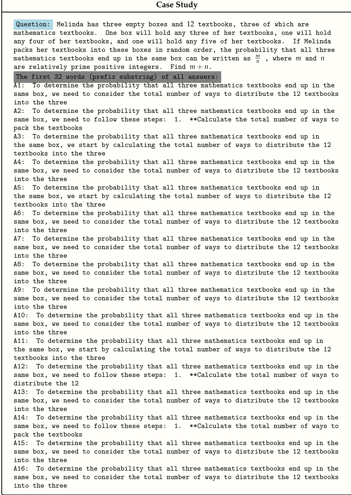
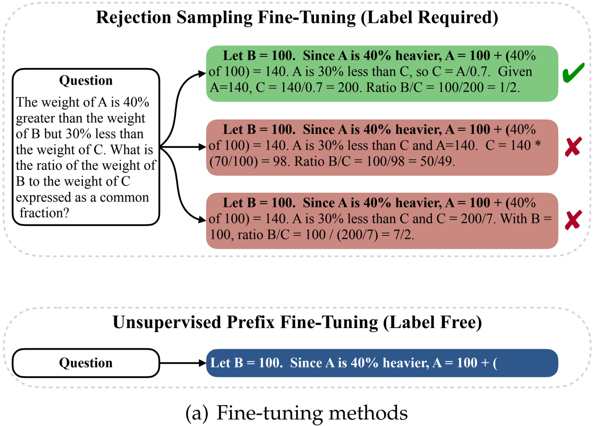

This paper introduces Unsupervised Prefix Fine-Tuning (UPFT), a novel method to enhance the reasoning capabilities of Large Language Models (LLMs) with high efficiency and without requiring labeled data or extensive sampling.

### Problem Statement

Improving LLM reasoning typically relies on supervised fine-tuning with human-annotated data or computationally expensive methods like Rejection Sampling Fine-Tuning (RFT) and Self-Taught Reasoner (STaR). These existing approaches are time-consuming, resource-intensive, and necessitate either ground-truth labels or sophisticated verification mechanisms, which are often unavailable or difficult to acquire, especially for complex reasoning tasks. The core problem addressed is how to design an efficient, scalable, and unsupervised method to enhance LLM reasoning capabilities.

### Methodology

The authors propose Unsupervised Prefix Fine-Tuning (UPFT), building on the observation of **Prefix Self-Consistency** – the phenomenon where different solution trajectories for the same question often share a common, highly consistent initial reasoning phase . This consistency suggests that critical reasoning signals are present in the early tokens of a solution.

UPFT's key aspects are:
*   **Prefix-based Training**: Instead of training on full reasoning traces, UPFT fine-tunes the model exclusively on the initial prefix substrings (as few as 8 tokens for some models) of generated responses. This eliminates the need for labeled data or exhaustive rejection sampling. The process is contrasted with Rejection Sampling Fine-Tuning (RFT) in .
*   **Unsupervised Data Generation**: For a given question, only a single prefix span `r < t` is decoded from the base model. Supervised Fine-Tuning (SFT) is then performed using a Negative Log-Likelihood (NLL) objective on these prefixes.
*   **Structure Tuning**: To mitigate catastrophic forgetting of full reasoning structures, UPFT incorporates a multi-task learning approach. A small percentage (p%) of the dataset is used to generate full reasoning traces (unsupervised, without correctness justification) and fine-tune on them, alongside prefix tuning. This ensures the model retains length generalization and instruction-following abilities. The task template for prefix tuning is designed to explicitly prompt for initial steps (Figure 3).
*   **Bayesian Interpretation**: The paper provides a mathematical formulation demonstrating how RFT can be viewed within a Bayesian framework that balances "Coverage" (exploration of solution paths) and "Accuracy" (likelihood of correct answer given a trace). UPFT aims to optimize this balance by focusing on prefixes, which enhance coverage while maintaining high accuracy, leveraging the insight that errors mostly appear in later reasoning steps (Figure 2(b)).

### Key Results & Analysis

UPFT demonstrates significant improvements in efficiency and competitive performance against supervised methods across various LLM architectures and reasoning benchmarks.

**Empirical Validation of Prefix Self-Consistency:**
*   **Early Reasoning Steps are Consistent**: An analysis on Llama-8B and Qwen-Math-7B shows a high degree of prefix overlap across 1,000 sampled trajectories for a given question. As prefix length increases, the average number of trajectories covered by a prefix pattern decreases, but consistent patterns persist, especially for math-specialized models (Figure 2(a)).
*   **Errors Occur in Later Stages**: Rollout samplings (32 per token) reveal that incorrect trajectories diverge significantly from correct ones in later steps. At early token positions (t ≤ 16), the rollout success rates for both correct and incorrect trajectories are strikingly similar (e.g., Qwen-Math-7B-Instruct at t=4, 85.7% vs 86.1%), suggesting initial prefixes are statistically robust (Figure 2(b)).

**Ablation Study (MATH500 dataset, Figure 4):**
*   **Impact of Prefix Length (Figure 4a)**: Optimal prefix length is model-dependent. Llama-3.1-8B-Instruct achieves peak accuracy (52.0%) with an 8-token prefix, while Qwen2.5-Math-7B-Instruct is stable between 8 and 32 tokens (85.4-85.6%). DeepSeek-R1-Distill-Qwen-7B, generating longer responses, performs best with a 128-token prefix.
*   **Impact of Structure Tuning Ratio (Figure 4b)**: Performance generally improves as the ratio of full-token samples (`p`) increases, peaking at p=10% for most datasets (e.g., Llama 53.4%, Qwen 85.6%). This indicates that minimal structural supervision is beneficial.

**Quantitative Performance & Efficiency Comparison:**

**Table 1: Unsupervised Fine-Tuning Performance & Efficiency (Selected Highlights from Table 2)**

| Model                       | Method | Data   | Avg. Length (Tokens) | GSM8K (%) | MATH500 (%) | AIME2024 (%) | GPQA (%) | Ave. (%) |
|-----------------------------|--------|--------|----------------------|-----------|-------------|--------------|----------|----------|
| Llama-3.1-8B-Instruct       | Base   | -      | -                    | 82.0      | 51.0        | 3.3          | 8.6      | 36.2     |
|                             | SFT    | PRM    | 175.8                | 83.8      | 48.4        | 3.3          | 8.6      | 36.0     |
|                             | UPFT   | PRM    | 15.8                 | 85.4      | 52.0        | 6.7          | 9.1      | 38.3     |
| Qwen2.5-Math-7B-Instruct    | Base   | -      | -                    | 95.2      | 84.0        | 16.7         | 9.6      | 51.4     |
|                             | SFT    | U-Hard | 393.3                | 95.5      | 83.4        | 16.7         | 9.6      | 51.3     |
|                             | UPFT   | U-Hard | 68.2                 | 96.0      | 85.6        | 26.6         | 9.6      | 54.5     |
| DeepSeek-R1-Distill-Qwen-7B | Base   | -      | -                    | 88.6      | 87.0        | 40.0         | 13.1     | 57.2     |
|                             | SFT    | U-Hard | 3440.4               | 89.7      | 87.0        | 36.7         | 12.1     | 56.4     |
|                             | UPFT   | U-Hard | 561.7                | 91.4      | 89.2        | 50.0         | 15.7     | 61.6     |

**Table 2: Supervised Fine-Tuning Performance & Efficiency (PRM-12K Dataset from Table 3)**

| Model                       | Method          | Sampling Tokens (M) | Tuning Tokens (M) | GSM8K (%) | MATH500 (%) | AIME2024 (%) | GPQA (%) | Ave. (%) |
|-----------------------------|-----------------|---------------------|-------------------|-----------|-------------|--------------|----------|----------|
| Llama-3.1-8B-Instruct       | Baseline        | -                   | -                 | 82.0      | 51.0        | 3.3          | 8.6      | 36.2     |
|                             | RFT             | 36.9                | 2.3               | 86.0      | 52.0        | 6.7          | 9.1      | 38.5     |
|                             | V-STaR          | * (16 samples)      | 6.8               | 85.4      | 52.6        | 6.7          | 8.6      | 38.3     |
|                             | UPFT (Ours)     | 0.2                 | 0.2               | 85.4      | 52.0        | 6.7          | 9.1      | 38.3     |
|                             | UPFT+LabelFilter| 36.9                | 0.2               | 85.8      | 53.4        | 6.7          | 9.1      | 38.8     |
| Qwen2.5-Math-7B-Instruct    | Baseline        | -                   | -                 | 95.2      | 84.0        | 16.7         | 9.6      | 51.4     |
|                             | RFT             | 51.7                | 3.2               | 95.7      | 85.2        | 20.0         | 9.6      | 52.6     |
|                             | V-STaR          | * (16 samples)      | 9.6               | 96.0      | 85.4        | 20.0         | 10.1     | 52.9     |
|                             | UPFT (Ours)     | 0.6                 | 0.6               | 95.5      | 85.6        | 20.0         | 9.6      | 52.6     |
|                             | UPFT+LabelFilter| 51.7                | 0.6               | 96.0      | 85.6        | 20.0         | 10.1     | 52.9     |
| DeepSeek-R1-Distill-Qwen-7B | Baseline        | -                   | -                 | 88.6      | 87.0        | 40.0         | 13.1     | 57.2     |
|                             | RFT             | 318.0               | 19.9              | 90.7      | 87.0        | 40.0         | 11.1     | 57.2     |
|                             | UPFT (Ours)     | 5.0                 | 4.5               | 91.9      | 88.4        | 40.0         | 14.6     | 58.7     |
|                             | UPFT+LabelFilter| 318.0               | 4.5               | 92.3      | 89.2        | 40.0         | 13.6     | 58.8     |

*Note: Sampling tokens for V-STaR are not explicitly listed in Table 3 but are implied to be from 16 samples per instance, similar to RFT.*

*   **Unsupervised Fine-Tuning**: UPFT consistently outperforms conventional SFT across different datasets (PRM-12K, OMI2-600K, LIMO, U-Hard) and backbone models (Llama-3.1-8B-Instruct, Qwen2.5-Math-7B-Instruct, DeepSeek-R1-Distill-Qwen-7B). For example, with DeepSeek-R1 on U-Hard, UPFT achieves an average accuracy of 61.6% compared to SFT's 56.4%.
*   **Efficiency Gains**: UPFT reduces training sequence length by 82.6-94.7% compared to SFT, leading to 6.3-16.7 times faster training iterations and reduced memory consumption. For instance, DeepSeek-R1 with UPFT uses 561.7 tokens on average per sample versus SFT's 3440.4 tokens, yet achieves better performance.
*   **Performance on Complex Tasks**: UPFT shows more significant gains on challenging benchmarks like AIME2024 and GPQA, demonstrating its effectiveness in refining sophisticated reasoning skills.
*   **Competitive with Supervised Methods**: In the supervised setting (using PRM-12K data for comparison), UPFT matches or exceeds the performance of RFT and V-STaR, while drastically reducing computational costs. For DeepSeek-R1, UPFT achieves 58.7% average accuracy, outperforming RFT (57.2%) with 16 times fewer tuning tokens (4.5M vs 19.9M) and significantly fewer sampling tokens (5.0M vs 318.0M). Figure 1(b) visually represents how UPFT (blue) matches or exceeds RFT (green) accuracy for significantly fewer tuning tokens (red arrows show reduction).
*   **Compatibility with Label Verification**: When augmented with label filtering, UPFT (UPFT+LabelFilter) achieves peak performance, surpassing all baselines while maintaining a substantial advantage in tuning token count. For DeepSeek-R1, UPFT+LabelFilter reaches 58.8% average accuracy.

### Core Contribution

The single most significant and novel contribution of this work is the identification of **Prefix Self-Consistency** as a critical phenomenon in LLM reasoning trajectories and the development of **Unsupervised Prefix Fine-Tuning (UPFT)**. UPFT leverages this insight to efficiently enhance LLM reasoning by training only on minimal prefix substrings of model-generated responses, thereby eliminating the need for labeled data or computationally expensive rejection sampling, while matching or exceeding the performance of conventional supervised fine-tuning methods.

### Open Source Contributions

The authors introduce a new dataset called **U-Hard (100K questions)**, curated from publicly available online sources and filtered for challenging problems. No specific links for code or datasets are provided within the document.

### Noteworthy Citations

1.  **Yuan et al. (2023). *Scaling relationship on learning mathematical reasoning with large language models.*** This paper introduces Rejection Sampling Fine-Tuning (RFT), which is a primary supervised baseline that UPFT is compared against for efficiency and performance.
2.  **Zelikman et al. (2022). *Star: Bootstrapping reasoning with reasoning.*** This work proposes Self-Taught Reasoner (STaR), another influential self-improvement technique that requires multiple generated solutions and verification, serving as a baseline (or its variant V-STaR) for comparison with UPFT.
3.  **Wei et al. (2022). *Chain-of-thought prompting elicits reasoning in large language models.*** This foundational paper introduced Chain-of-Thought (CoT) prompting, a widely adopted technique for eliciting complex reasoning in LLMs, which forms the basis for many subsequent reasoning improvement methods.