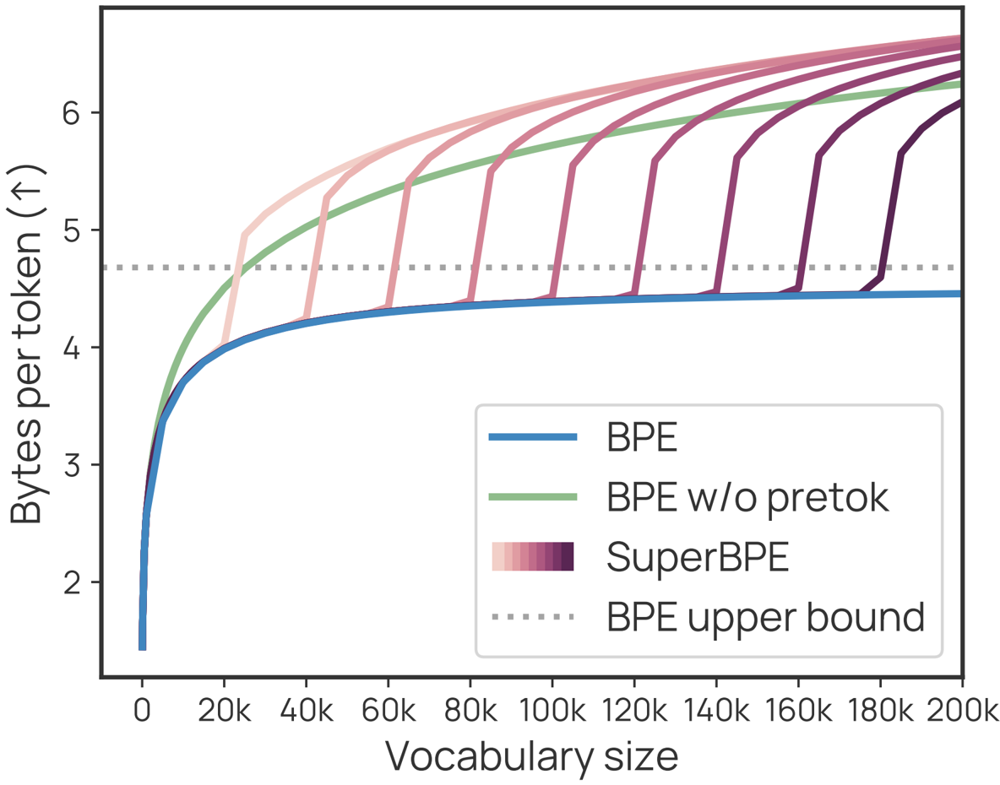
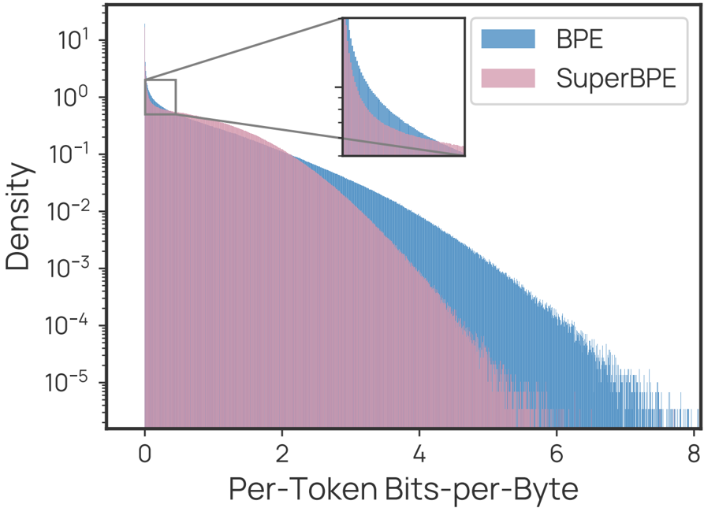

This paper introduces SuperBPE, a novel tokenization algorithm that extends the traditional Byte-Pair Encoding (BPE) to include "superword" tokens that can span across whitespace, challenging the long-standing assumption that tokens must be contained within word boundaries.

## Problem Statement

The core problem addressed is the limitation imposed by the ubiquitous subword tokenization schemes in language models (LMs), which assume tokens should not bridge whitespace. The authors question whether this practice restricts the potential of modern LMs, arguing that whitespace is an unreliable delimiter of meaning (e.g., multiword expressions, cross-lingual word structures, and non-whitespace languages like Chinese). This conventional approach can lead to suboptimal encoding efficiency and may not capture semantically cohesive units effectively.

## Methodology

The authors propose **SuperBPE**, a modification to the standard Byte-Pair Encoding (BPE) algorithm, which introduces a simple pretokenization curriculum across two discrete phases:
1.  **Stage 1 (Subword Learning)**: Similar to conventional BPE, whitespace pretokenization is initially used to enforce the learning of subword tokens only, meaning merges cannot bridge whitespace. This stage continues until a predefined "transition point" vocabulary size `t` is reached.
2.  **Stage 2 (Superword Learning)**: After the transition point `t`, whitespace pretokenization is disabled. This lifts the restriction on merging across whitespace, allowing the algorithm to learn "superword" tokens that capture common multi-word expressions.

SuperBPE tokenizers are trained once, and the choice of `t` (e.g., 80k, 160k, 180k for a 200k vocabulary) controls the balance between subword and superword tokens. The method also incorporates minor modifications like pretokenizing digits into blocks of 3 and special-casing the colon character to prevent distorted distributions in common QA formats.

## Key Results & Analysis

*   **Encoding Efficiency**: SuperBPE dramatically improves encoding efficiency. For a fixed vocabulary size of 200k, SuperBPE encodes text with up to **33% fewer tokens** on average compared to BPE.
    *    illustrates this by showing "By the way, I am a fan of the Milky Way." encoded in 7 tokens by SuperBPE versus 13 by BPE.
    *    demonstrates that BPE's encoding efficiency (bytes-per-token) plateaus early (around 50k vocabulary), bounded by the average word length, while SuperBPE continues to improve significantly with increased vocabulary size, exceeding BPE's theoretical upper bound at merely ~12k vocabulary.
    *   The most encoding-efficient SuperBPE variant achieved 6.63 bytes-per-token at a transition point `t` = 80k.

*   **Downstream Task Performance (8B Models)**: Pretraining 8B transformer LMs from scratch while fixing model size, vocabulary size, and training compute, SuperBPE models consistently and significantly outperform their BPE counterparts.

| Category             | Task                         | BPE 8B (%) | SuperBPE 8B (t=180k) (%) | ∆ (%)    |
| :------------------- | :--------------------------- | :--------- | :----------------------- | :------- |
| Knowledge            | ARC-Easy (MC)                | 46.6       | 67.1                     | +20.5**  |
|                      | ARC-Challenge (MC)           | 35.1       | 50.6                     | +15.5**  |
|                      | MMLU (MC)                    | 36.5       | 44.7                     | +8.2**   |
|                      | OpenbookQA (MC)              | 33.2       | 54.4                     | +21.2**  |
| Math & Reasoning     | Arithmetic (EM)              | 54.8       | 59.3                     | +4.5**   |
| Commonsense          | CommonsenseQA (MC)           | 33.5       | 53.8                     | +20.3**  |
|                      | COPA (MC)                    | 77.0       | 85.8                     | +8.8**   |
|                      | PIQA (MC)                    | 55.2       | 59.8                     | +4.6*    |
|                      | Winogrande (MC)              | 47.3       | 52.6                     | +5.3*    |
| Language Understanding | HellaSwag (MC)               | 29.7       | 33.7                     | +4.0**   |
| **Average**          |                              | **39.8**   | **43.8**                 | **+4.0** |

    *   The best SuperBPE model (with `t=180k`) achieved an average absolute improvement of **+4.0%** across 30 downstream tasks and won on 25 of them.
    *   It showed remarkable gains, including **+8.2% on MMLU** and over 20% on ARC-Easy, ARC-Challenge, and CommonsenseQA.
    *   [Figure 3] illustrates SuperBPE models consistently outperforming the BPE baseline throughout pretraining.

*   **Inference Compute Efficiency**: SuperBPE models simultaneously require **27% less compute at inference time** (comparing SuperBPE 8B, t=180k, to BPE 8B, 3.75 vs 2.65 E9 FLOPs/byte). The most encoding-efficient SuperBPE (t=80k) offered a 35% reduction in inference compute.

*   **Loss Distribution Analysis**: Despite similar average bits-per-byte (BPB) language modeling loss, SuperBPE produces segmentations that are more uniform in per-token difficulty.
    *    shows that SuperBPE models make fewer predictions with either very high or very low loss compared to BPE.
    *   The reduction in low-loss tokens is attributed to SuperBPE merging common single words (like "the") that BPE easily predicts into larger superword tokens.
    *   The thinner tail of very high-loss tokens suggests SuperBPE models are better at predicting difficult tokens, potentially explaining their superior downstream task performance.
    *   [Table 3] provides linguistic evidence, showing that SuperBPE tokens often capture common multi-word expressions (e.g., "by accident", "in the long run") that function as single semantic units, simplifying their prediction.

*   **Scaling Behavior**: At smaller scales (680M and 1.9B), SuperBPE models with matching parameter counts achieved lower BPB in the under-trained regime, while SuperBPE models designed to match inference compute consistently achieved lower BPB than the baseline across various training budgets . The differences between models increased with overtraining.

## Core Contribution

The single most significant and novel contribution of this work is SuperBPE: a straightforward, local modification to the widely used BPE tokenization algorithm that enables the learning of "superword" tokens bridging whitespace. This innovation dramatically improves encoding efficiency and leads to substantial performance gains in large language models across a diverse range of downstream tasks, while simultaneously reducing inference compute, all without requiring any changes to the core model architecture, training framework, or decoding strategy.

## Open Source Contributions

Code and artifacts are available at: https://superbpe.github.io/

## Noteworthy Citations

1.  **Sennrich et al., 2016 (Neural machine translation of rare words with subword units)**: This paper introduced the Byte-Pair Encoding (BPE) algorithm to natural language processing, forming the foundation that SuperBPE builds upon.
2.  **Hoffmann et al., 2022 (Training compute-optimal large language models)** / **Kaplan et al., 2020 (Scaling laws for neural language models)**: These works are crucial for understanding the scaling behavior of language models and how SuperBPE's efficiency gains can be leveraged in terms of training budget and model size.
3.  **Mielke et al., 2021 (Between words and characters: A brief history of open-vocabulary modeling and tokenization in nlp)**: Provides a comprehensive survey of open-vocabulary modeling and tokenization strategies, offering valuable context for SuperBPE's position within the field.