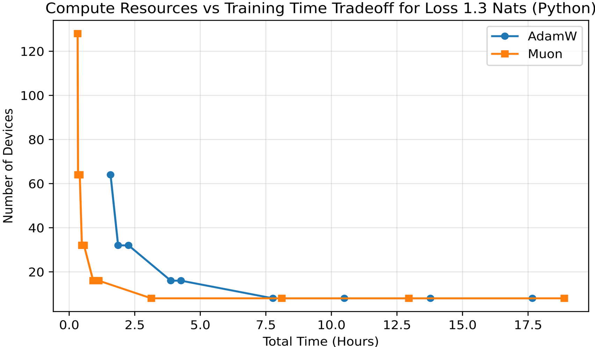
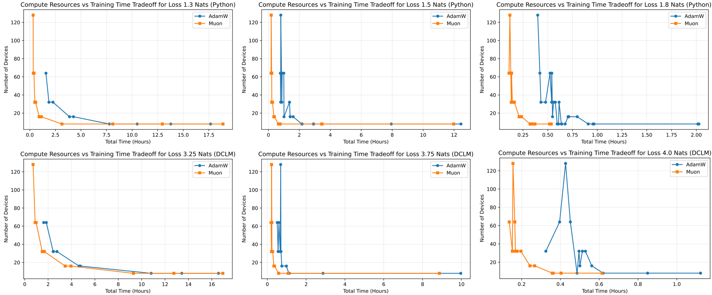
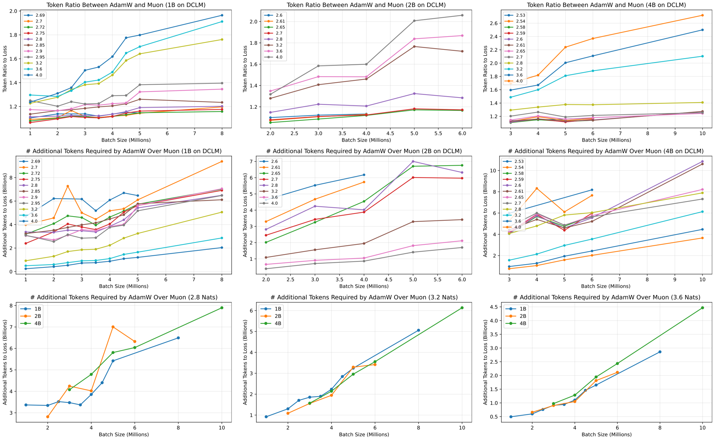
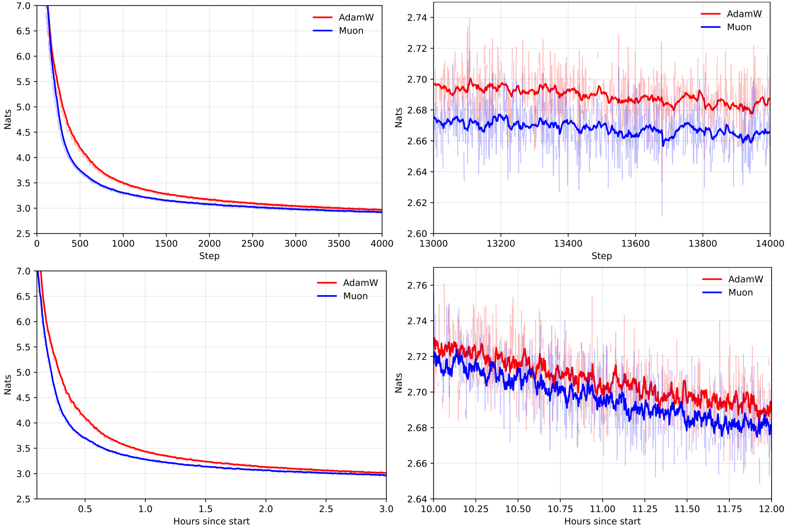
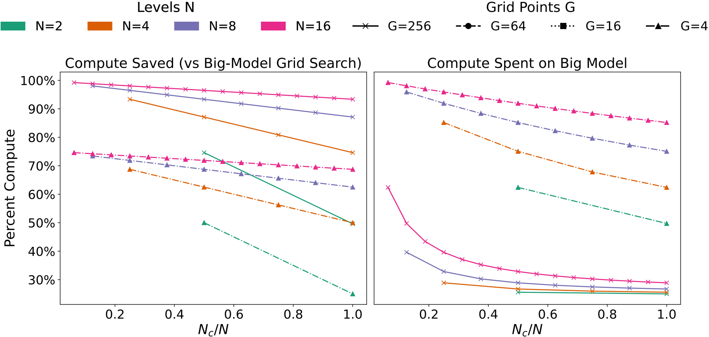
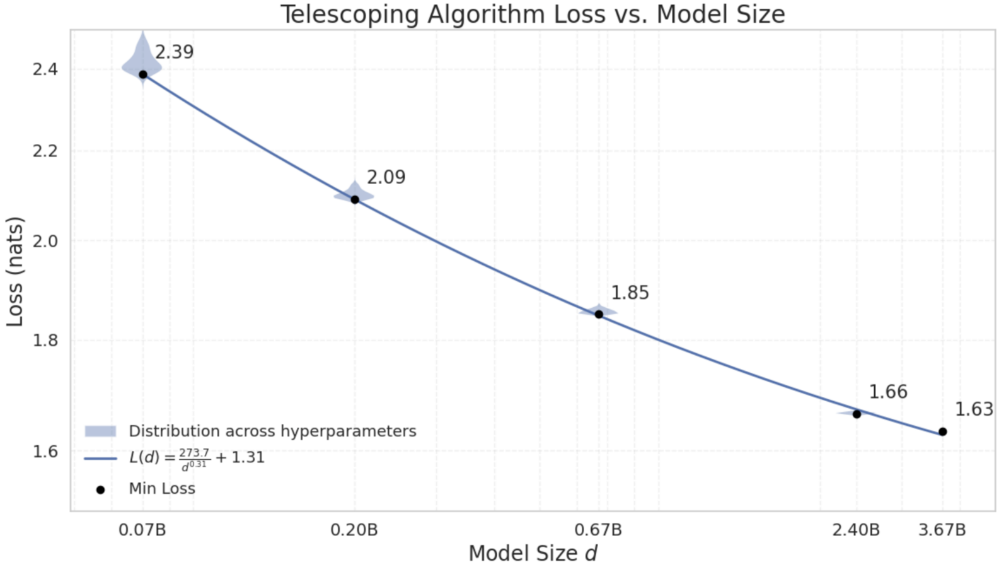

This paper, authored by Essential AI, investigates the practical efficiency of Muon, a second-order optimizer, for pretraining large language models (LLMs), and proposes an efficient hyperparameter tuning method compatible with it.

### Problem Statement

The paper addresses two core problems in LLM pretraining:

1.  **Practical Efficiency of Optimizers**: Current evaluations of optimizers often rely on wall-clock time or FLOPs at fixed resources, failing to capture the fundamental compute-time tradeoff. It is unclear if second-order optimizers like Muon offer a true practical advantage over AdamW across varying resource allocations and batch sizes, especially beyond the "critical batch size" where data efficiency typically diminishes.
2.  **Efficient Hyperparameter Tuning for LLMs**: Brute-force hyperparameter searches are prohibitively expensive for large models. While methods like Maximal Update Parameterization (muP) offer principled transfer, they suffer from practical limitations such as finite-width biases and sampling errors, requiring multi-scale tuning and potentially obscuring true optima. Furthermore, the compatibility of muP with novel optimizers like Muon remained an open question.

### Methodology

The authors employed a two-pronged approach:

1.  **Optimizer Comparison (Muon vs. AdamW)**:
    *   **Metric**: Instead of wall-clock time or FLOPs, they compared optimizers using "iso-loss frontiers" on a compute-time plane. This involves measuring the total training time to reach a target loss as a function of the number of devices (and corresponding batch size).
    *   **Data Efficiency**: They introduced a "token ratio" metric, $R_L(B) = T_{L,A}(B) / T_{L,M}(B)$, to quantify the relative data efficiency of Muon over AdamW at varying batch sizes (B) for a target loss (L).
    *   **Muon Implementation**: Used a straightforward in-house Jax implementation of Muon (adapted from Optax), applying it to transformer's weight matrices using Newton-Schulz iteration, while using Adam for embedding and normalization layers.
    *   **Experimental Setup**: Evaluated on modern decoder-only transformer models (Gemma 3 variant) ranging from 100M to 4B parameters, using diverse data (Python code from Stack V2, web text from DCLM), and trained on TPU v5p chips. They varied batch sizes from 128K to 16M to explore the compute-time tradeoff.

2.  **Hyperparameter Tuning with Muon and muP**:
    *   **MuP Compatibility**: Empirically demonstrated the successful hyperparameter transfer with muP for Muon (extending known results for AdamW).
    *   **Telescoping Algorithm**: Proposed a novel "telescoping algorithm" (Algorithm 1) to account for finite-width biases (O(1/n) corrections) and sampling errors in muP. This algorithm starts with a broad grid search at a small model width ($N_0$) and successively doubles the model width ($n \leftarrow 2n$) while geometrically reducing the number of sweep points and adjusting mesh resolution (e.g., by $4^{-1/k}$ for $k$ hyperparameters). This ensures optimal hyperparameters are tracked efficiently across scales.

### Key Results & Analysis

The paper presents compelling evidence for Muon's practical advantages and the efficiency of the telescoping algorithm:

| Metric / Finding                          | Muon Performance                                                                                                                                                                                                                                                                       | AdamW Performance                                                                                                                                                                      |
| :---------------------------------------- | :------------------------------------------------------------------------------------------------------------------------------------------------------------------------------------------------------------------------------------------------------------------------------------- | :------------------------------------------------------------------------------------------------------------------------------------------------------------------------------------- |
| **Compute-Time Tradeoff (Pareto Frontier)** | Explicitly expands the Pareto frontier on the compute-time tradeoff for various loss thresholds and data distributions , . Offers more flexibility in resource allocation (e.g., shorter training time for the same compute, or less compute for the same time). | Bounded by Muon's frontier.                                                                                                                                                            |
| **Data Efficiency (Token Ratio $R_L(B)$)** | $R_L(B) > 1$ and is generally increasing at higher losses and at least constant at lower losses . This indicates superior data efficiency, especially at large batch sizes, extending beyond any "critical batch size."                                                   | Requires more tokens to reach the same loss compared to Muon, particularly at larger batch sizes. Its relative data efficiency diminishes.                                         |
| **Additional Tokens Required (AdamW vs. Muon)** | N/A                                                                                                                                                                                                                                                                                    | Requires 10-15% more tokens than Muon to reach an identical loss. The unnormalized additional tokens ($T_{L,A}(B) - T_{L,M}(B)$) strictly increase with batch size . This additional token requirement (e.g., ~2B tokens for 3.2 nats) is surprisingly agnostic to model size (1B, 2B, 4B models). |
| **Training Loss and Convergence**         | Consistently achieves lower training loss and faster convergence in wall-clock time compared to AdamW . The difference does not vanish even far beyond Chinchilla-optimal budget.                                                                                                | Higher training loss and slower convergence compared to Muon.                                                                                                                          |
| **muP Compatibility**                     | First empirical demonstration of successful hyperparameter transfer with muP for Muon (learning rate and coupled weight decay).                                                                                                                                                        | Known to work for AdamW.                                                                                                                                                               |
| **Telescoping Algorithm Cost/Efficiency** | Introduces an additional O(C log N) compute cost for hyperparameter tuning (where C is final model cost, N is width).                                                                                                                                                                  | Brute-force grid search would incur prohibitive costs (e.g., 30% of total compute budget for a smaller model for 8x8 grid).                                                               |
| **Telescoping Algorithm Savings**         | Leads to compute savings typically higher than 50% compared to a brute-force grid search on the full model, with 20%-99% of total compute budget devoted to final model training .                                                                                               | N/A                                                                                                                                                                                    |
| **Loss Distribution & Scaling Law Fit**   | Each iteration of the telescoping procedure reduces loss variance, providing precise estimates. Minimum loss values fit a Chinchilla-style scaling law $L(d) = A/d^\alpha + E$ with $\alpha = 0.31$ (close to Chinchilla's 0.34) and $R^2 \approx 1$ .                               | N/A                                                                                                                                                                                    |

### Core Contribution

The single most significant contribution of this work is the **explicit demonstration that Muon, a second-order optimizer, rigorously expands the Pareto frontier over AdamW on the compute-time tradeoff for LLM pretraining**, making it a strictly more flexible and economical choice. This is coupled with the successful validation of muP for Muon and the introduction of a practical, computationally efficient "telescoping algorithm" for hyperparameter tuning, which quantifies and controls transfer errors. This work elevates second-order optimization from theoretical promise to a practical, default choice for industrial-scale LLM training.

### Open Source Contributions

The authors state that all experimental artifacts will be released at:
*   **Hugging Face**: `https://huggingface.co/EssentialAI`
The Muon implementation used is adapted from an existing Optax library:
*   **Optax**: `https://github.com/google-deepmind/optax/blob/6bd761c00d839ca363bffac2584888ac797fc69d/optax/contrib/_muon.py`

### Noteworthy Citations

1.  **Kingma, D. P. and Ba, J. (2014). Adam: A method for stochastic optimization. arXiv preprint arXiv:1412.6980.** (The foundational paper for the Adam optimizer, against which Muon is primarily compared.)
2.  **Loshchilov, I. and Hutter, F. (2017). Decoupled weight decay regularization. arXiv preprint arXiv:1711.05101.** (Introduces AdamW, the direct baseline for comparison in this study.)
3.  **Yang, G., Hu, E. J., Babuschkin, I., Sidor, S., Liu, X., Farhi, D., Ryder, N., Pachocki, J., Chen, W., and Gao, J. (2022). Tensor programs v: Tuning large neural networks via zero-shot hyperparameter transfer. arXiv preprint arXiv:2203.03466.** (The seminal work on Maximal Update Parameterization (muP), which is extended and validated in this paper for use with Muon.)
4.  **Jordan, K., Jin, Y., Boza, V., Jiacheng, Y., Cesista, F., Newhouse, L., and Bernstein, J. (2024). Muon: An optimizer for hidden layers in neural networks.** (The original paper introducing Muon, the optimizer whose practical efficiency is the central subject of this study.)