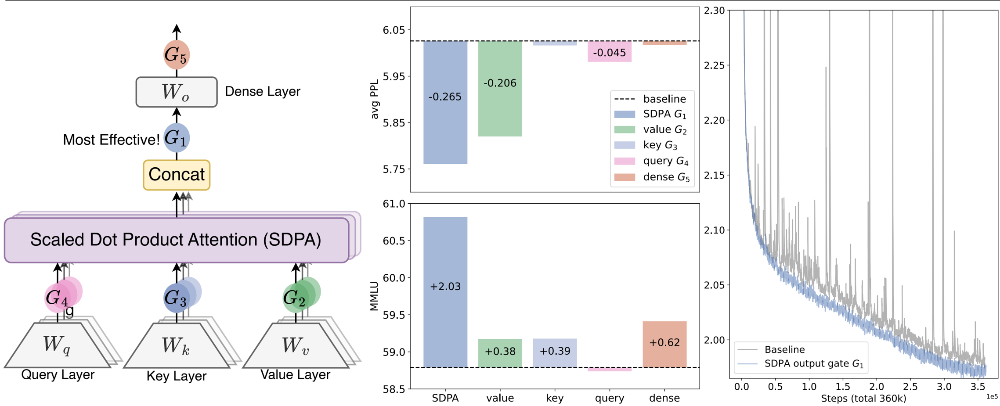

This paper presents a comprehensive investigation into the role and impact of gating mechanisms within standard softmax attention layers in Large Language Models.

### 1. Problem Statement

Despite the widespread adoption and empirical success of gating mechanisms in various neural network architectures (from LSTMs to modern state-space models and attention variants), there is an "insufficient understanding" of their specific effects and contributions. Existing literature rarely systematically examines *why* gating works or *how* it impacts model behavior, often conflating its benefits with other architectural factors. This lack of detailed exploration hinders a clear assessment of gating's intrinsic value and potential for optimized design.

### 2. Methodology

The authors conduct a systematic experimental investigation of gating-augmented softmax attention. Their approach involves:
*   **Gating Positions**: Exploring five distinct positions for applying gating within the attention layer: after query (G4), key (G3), and value (G2) projections; following the Scaled Dot-Product Attention (SDPA) outputs (G1); and after the final dense output layer (G5). These positions are illustrated in  (Left).
*   **Gating Variants**: Evaluating different granularities (headwise vs. elementwise), sharing strategies (head-specific vs. head-shared), application forms (multiplicative vs. additive), and activation functions (sigmoid vs. SiLU).
*   **Model Architectures**: Training over 30 variants of 15B Mixture-of-Experts (MoE) models (15A2B) and 1.7B dense models.
*   **Training Scale**: Models are trained on a massive 3.5 trillion token dataset.
*   **Analysis**: Attributing the effectiveness of gating to two primary factors: introducing non-linearity upon the low-rank mapping in softmax attention and applying query-dependent sparse gating scores. They also analyze the impact on training stability, attention sink phenomenon, and long-context extrapolation.

### 3. Key Results & Analysis

The study reveals several significant findings:

*   **Optimal Gating Position**: Gating applied *after the Scaled Dot-Product Attention (SDPA) output (G1)* consistently yields the most significant performance improvements, followed by gating after the value layer (G2).  (Middle) and  (Middle) visually demonstrate the superior performance of G1.
*   **Performance Gains**: The SDPA output gating (G1) leads to substantial reductions in perplexity (PPL) and improvements across various benchmarks, outperforming various parameter-expanding baselines.
*   **Training Stability and Scaling**: SDPA output gating significantly enhances training stability, nearly eliminating loss spikes (as shown in  (Right) and  (Right)). This stability allows for the use of larger learning rates and batch sizes, facilitating better model scaling without divergence.
*   **Mechanisms of Effectiveness**:
    1.  **Non-linearity**: Gating at G1 or G2 effectively introduces non-linearity between the value projection ($W_V$) and the final dense output ($W_O$) layers, which would otherwise form a low-rank linear mapping. This increases the expressiveness of the attention mechanism.
    2.  **Sparsity**: The most effective gating variants (especially SDPA output gating) exhibit highly sparse, query-dependent gating scores. , , and  illustrate the sparse distribution of these scores, which effectively modulate and filter the SDPA output.
*   **Attention Sink Mitigation**: Query-dependent sparse gating at the SDPA output largely mitigates the 'attention sink' phenomenon, where initial tokens disproportionately dominate attention scores. The baseline model shows an average of 46.7% attention on the first token, while the SDPA-gated model reduces this to 4.8%. This is vividly depicted in  (Right) and . The analysis also suggests that massive activations are not a prerequisite for attention sinks.
*   **Long-Context Extrapolation**: Gated attention models demonstrate superior performance in length generalization on the RULER benchmark, especially when context lengths are extended beyond training limits (e.g., 128k tokens).

**Quantitative Results Summary (Selected from Tables 1, 2, 4, 5):**

| Method                                      | Added Param (M) | Avg PPL (Lower is better) | MMLU (Higher is better) | First Token Attn Score (Lower is better) | Max Activation Value (Lower is better) | RULER 128k Score (Higher is better) |
| :------------------------------------------ | :-------------- | :------------------------ | :---------------------- | :--------------------------------------- | :------------------------------------- | :---------------------------------- |
| **Baseline (MoE 15B)**                      | 0               | 6.026                     | 58.79                   | 0.467                                    | 1053                                   | 31.65                               |
| **SDPA Elementwise Gate (G1)**              | 201             | **5.761**                 | **60.82**               | **0.048**                                | **94**                                 | **58.82**                           |
| Value Elementwise Gate (G2)                 | 25              | 5.820                     | 59.17                   | 0.297                                    | 125                                    | -                                   |
| SDPA Headwise Gate (G1)                     | 1.6             | 5.792                     | 60.05                   | 0.073                                    | 98                                     | -                                   |
| SDPA Head-Shared Gate (G1)                  | 201             | 5.801                     | 60.06                   | 0.301                                    | 286                                    | -                                   |
| SDPA Additive Gate (G1) (SiLU)              | 201             | 5.821                     | 60.06                   | -                                        | -                                      | -                                   |
| SDPA Elementwise Gate (G1) (SiLU)           | 201             | 5.822                     | 60.49                   | 0.451 (NS-sigmoid)                       | 892 (NS-sigmoid)                       | -                                   |
| Baseline (Dense 1.7B, 3.5T, LR 4.5e-3)      | 0               | 6.180                     | 59.10                   | -                                        | -                                      | -                                   |
| SDPA Elementwise (Dense 1.7B, 3.5T, LR 4.5e-3) | Same params     | **6.130**                 | **59.61**               | -                                        | -                                      | -                                   |

### 4. Core Contribution

The single most significant contribution of this work is the systematic and comprehensive experimental investigation revealing that a **simple, head-specific sigmoid gate applied after the Scaled Dot-Product Attention (SDPA) output** consistently and substantially improves LLM performance, enhances training stability, and allows for better scaling. The paper rigorously attributes this effectiveness to the introduction of **non-linearity** in a critical architectural bottleneck and, crucially, to the creation of **input-dependent sparsity** which effectively mitigates the **'attention sink' phenomenon** and improves long-context extrapolation.

### 5. Open Source Contributions

The authors state they will:
*   "release related codes and models to facilitate future research."
*   "open-source our attention-sink-free models to advance future research."
(No specific URLs were provided in the document.)

### 6. Noteworthy Citations

1.  **Vaswani, 2017 (Attention Is All You Need)**: The foundational paper introducing the Transformer architecture and softmax attention, which this work directly builds upon and modifies.
2.  **Hochreiter & Schmidhuber, 1997 (Long short-term memory)**: An essential early work on recurrent neural networks that pioneered the use of gating mechanisms to control information flow and address vanishing/exploding gradients.
3.  **Xiao et al., 2023 (Efficient streaming language models with attention sinks)**: This paper formally identifies and characterizes the 'attention sink' phenomenon, a key inefficiency that the present work successfully mitigates.