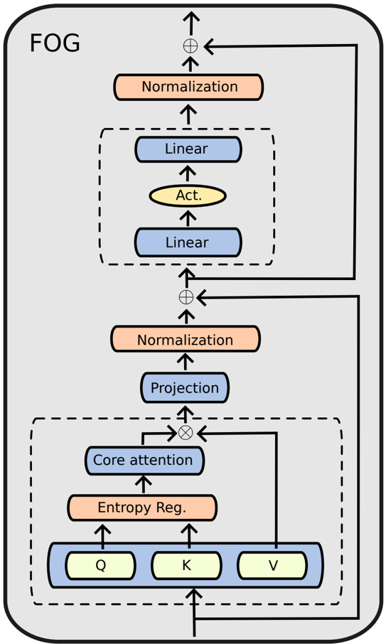
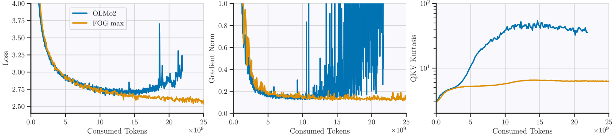
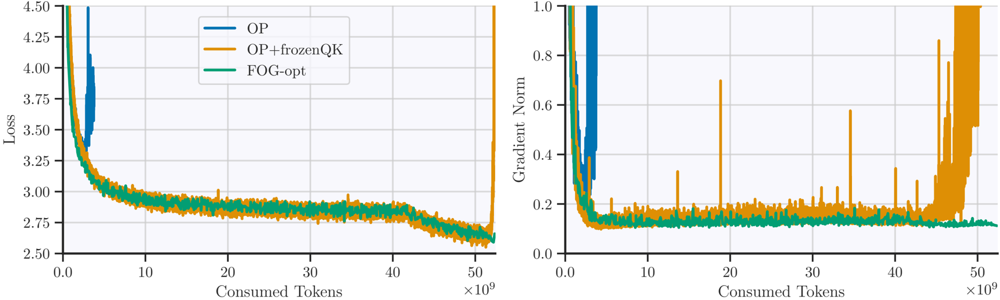
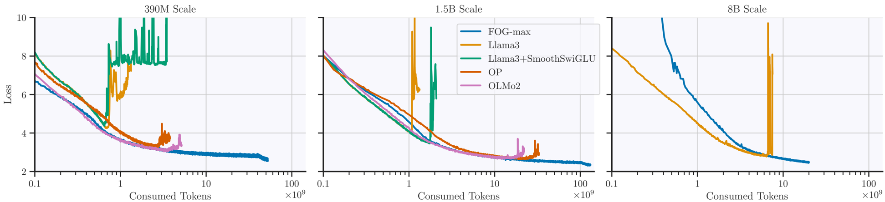
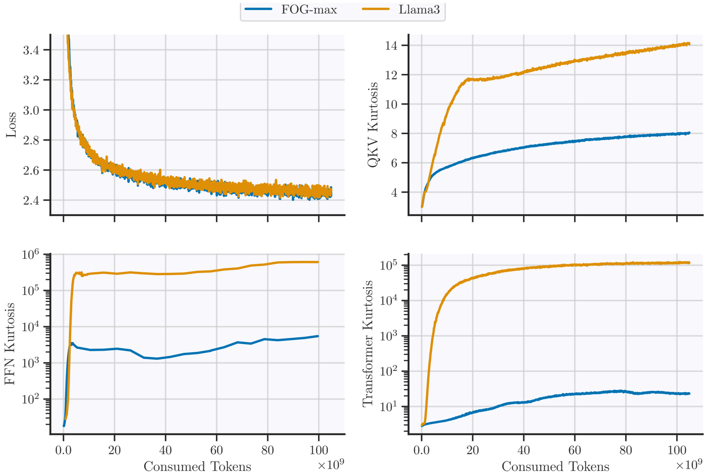
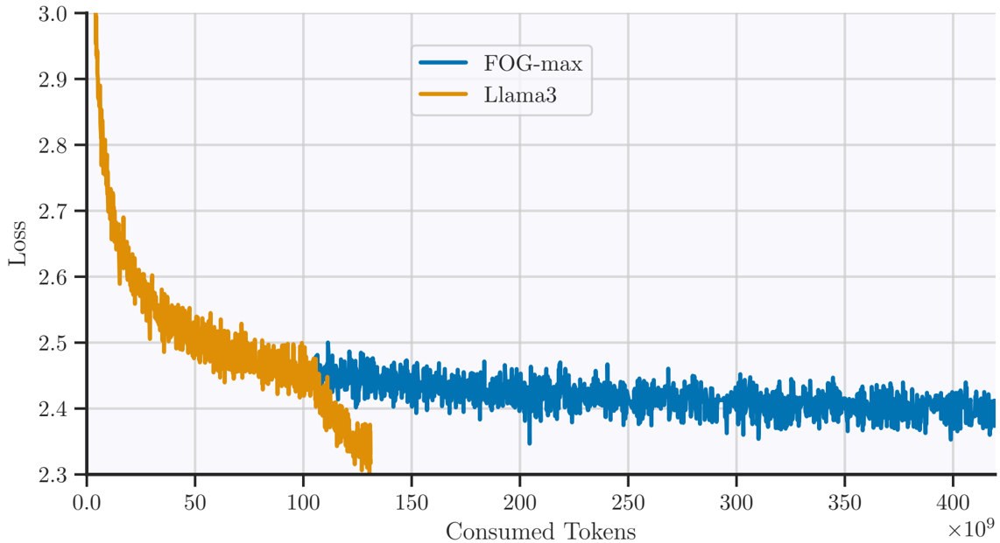

This paper addresses the significant challenge of adopting FP8 data formats for large language model (LLM) pre-training, particularly the difficulty in maintaining stability at scale when attempting to use FP8 for all General Matrix Multiplications (GEMMs), including those in the attention mechanism.

## Problem Statement

The core problem is the limited adoption of FP8 for LLM training due to stability issues at scale. Existing FP8 training approaches often fall short by:
1.  Relying on suboptimal, fine-grained FP8 kernels that introduce efficiency overhead.
2.  Falling back to higher-precision (e.g., BF16) GEMMs in sensitive components like attention projections, which compromises potential throughput gains.
3.  Struggling with the narrow dynamic range of FP8 formats, leading to underflows/overflows due to large outlier activations common in LLMs.
Specifically, achieving "FP8DPA" (FP8 Dot Product Attention) training, where *all* GEMMs within transformer blocks (including query-key and attention-value computations) are in FP8, remains an underexplored and largely unstable area.

## Methodology

The authors introduce **FOG (Fast and Outlier-Guarded)**, a new class of LLM architectures specifically designed for stable and efficient FP8DPA training. Key methodological aspects include:

*   **Architectural Modifications (FOG Suite)**:  illustrates the FOG transformer block.
    *   **Post-Normalization**: Removes pre-normalization before the attention mechanism and FFN. Instead, a learnable normalization (LayerScale or RMSNorm) is applied *before* residual connections, initialized to $1/\sqrt{\text{num_layers}}$, resulting in a post-normalized architecture. This is crucial for handling FP8 outliers, especially during the learning rate decay phase.
    *   **Attention Entropy Regularization**: Adds a normalization mechanism within the attention block to prevent entropy collapse. This can be a QK RMSNorm (with *non-trainable* gains) or a `tanh(αx)` element-wise activation applied to query and key tensors. Freezing QK RMSNorm gains and slightly increasing the softmax temperature (e.g., by multiplying the standard $1/\sqrt{D_{qk}}$ by a constant slightly greater than 1) is found to be critical for stability.
    *   **Input Scaling**: The input of the first transformer block is scaled by $\sigma^{-1}$ to maintain unit variance activations at initialization.
    *   **Activation Functions**: Explores `xIELU` (in FOG-max) and `GeLU` (in FOG-opt, FOG-flash), showing that with FOG's outlier mitigation, even quadratic activations like `xIELU` can be used stably.

*   **FP8 Scaling Strategy**: Utilizes a low-overhead, tensor-wise *delayed scaling strategy* with a margin of zero and a history length of 1024 steps, leveraging NVIDIA's Transformer Engine. This contrasts with more granular, high-overhead scaling methods.

*   **Outlier Monitoring with Kurtosis**: Employs kurtosis, defined as $\text{kurt}(x) = \frac{\frac{1}{D} \sum_{i=1}^D (x_i - \mu)^4}{(\sigma^2)^2}$ (where $x \in R^D$, $\mu$ is mean, $\sigma^2$ is variance), as a quantitative metric to track the extremity of deviations (outliers) in key activations (FFN inputs, QKV matrix, transformer block outputs). This metric is shown to predict training instabilities much earlier than traditional loss or gradient norm checks.  demonstrates this predictive power.

*   **Ablation Studies**: Detailed ablations show the step-by-step transition from the OP architecture to FOG-opt, highlighting the importance of frozen QK RMSNorm gains and post-normalization for FP8DPA stability.  illustrates this transition.

## Key Results & Analysis

The FOG architectures achieve unprecedented stability and throughput for fully FP8 GEMM training, matching or exceeding BF16 baseline quality.

**1. FP8 Stability (FP8DPA)**:
*   FOG architectures (FOG-max, FOG-opt, FOG-flash) are the *only* architectures tested that successfully complete FP8DPA training across 0.4B, 1.5B, and 8B parameter scales without divergence.
*   All other tested architectures (Llama3, Llama3+SmoothSwiGLU, OP, OLMo2) consistently diverge early when attempting FP8DPA training.  visually confirms this widespread divergence.
*   **Larger models tend to diverge *later* in training with FP8DPA** (Table 2).

**Divergence Marks (in billions of tokens):**
| Architecture         | Model Size | Divergence Mark (in billions of tokens) |
| :------------------- | :--------- | :-------------------------------------- |
| Llama3               | 390M       | 0.7                                     |
| Llama3               | 1.5B       | 1.1                                     |
| Llama3               | 8B         | 6.6                                     |
| OLMo2                | 390M       | 3.3                                     |
| OLMo2                | 1.5B       | 15.9                                    |

**2. Long-Term Outlier Dynamics & Kurtosis**:
*   FOG architectures exhibit sub-linear to logarithmic long-term growth of QKV outliers (kurtosis), indicating robustness.  shows FOG-max maintaining orders of magnitude lower kurtosis in FFN and transformer block activations compared to Llama3.
*   This low kurtosis allows for stable use of quadratic activation functions like `xIELU` in FOG-max over long training periods (420B tokens), challenging prior explanations for quadratic activation instability.
*   QKV kurtosis reliably predicts divergence much earlier than loss or gradient norm.  demonstrates QKV kurtosis diverging at 3B tokens, while loss diverges at 15B and gradient norms spike at 12B.

**3. Downstream Performance**:
*   FOG variants achieve comparable or slightly superior downstream performance to BF16 Llama3 baselines across various tasks (Hellaswag, ARC, PIQA, etc.).
*   FOG-max, utilizing `xIELU`, sometimes outperforms other FOG variants and the BF16 baseline.

**Performance across various tasks (1.5B models):**
| Architecture | Hellaswag | ARC | PIQA | Commonsense-qa | Lambada-openai | Lambada-standard | Openbook-qa | Social-iqa | Winogrande | Average |
| :----------- | :-------- | :-- | :--- | :------------- | :------------- | :--------------- | :---------- | :--------- | :--------- | :------ |
| Llama3 (BF16)| 43.7      | 71.8| 72.5 | 19.6           | 44.5           | 38.9             | 26.2        | 41.3       | 56.5       | 46.1    |
| FOG-max (FP8DPA) | 43.4      | 73.0| 73.3 | 22.2           | 44.6           | 39.5             | 27.0        | 42.0       | 58.7       | 47.1    |
| FOG-opt (FP8DPA) | 42.7      | 70.8| 72.0 | 21.2           | 44.5           | 37.9             | 27.0        | 40.8       | 57.4       | 46.0    |
| FOG-flash (FP8DPA) | 41.9      | 69.4| 72.0 | 20.8           | 41.2           | 33.8             | 27.6        | 40.8       | 56.8       | 44.9    |

**4. Efficiency**:
*   FOG architectures demonstrate significant throughput gains, especially at larger scales.

**Throughput (tokens/second/GPU):**
| Size | Model                | Precision | Throughput (tokens/second/GPU) |
| :--- | :------------------- | :-------- | :----------------------------- |
| 8B   | Llama                | BF16      | 9105                           |
|      | **FOG-max**          | **FP8DPA**| **12344 (+35.5%)**             |
|      | **FOG-opt**          | **FP8DPA**| **12414 (+36.3%)**             |
|      | **FOG-flash**        | **FP8DPA**| **12764 (+40.2%)**             |
|      | Llama+SmoothSwiGLU | FP8       | 12228 (+34.3%)                 |
| 1.5B | Llama                | BF16      | 46470                          |
|      | **FOG-max**          | **FP8DPA**| **53551 (+15.2%)**             |
|      | **FOG-opt**          | **FP8DPA**| **53877 (+15.9%)**             |
|      | **FOG-flash**        | **FP8DPA**| **54848 (+18.0%)**             |
|      | Llama+SmoothSwiGLU | FP8       | 54903 (+18.1%)                 |

**5. Long-Data Regimes**:
*   FOG-max 1.5B was trained stably for 420 billion tokens, which is 14 times the Chinchilla-optimal data budget for its size.
*   This training also successfully integrated FP16 optimizer states and BF16 gradients after 130B tokens, saving memory.  illustrates the smooth loss progression over this extended run.

## Core Contribution

The single most significant contribution of this work is the introduction of **FOG, a novel class of LLM architectures that, for the first time, enables stable and efficient FP8 computation for *all* GEMMs within transformer blocks during both forward and backward passes, including the attention mechanism (FP8DPA)**. This achieves unprecedented throughput gains (up to 40% faster) while matching the downstream performance of standard BF16 training, using low-overhead delayed scaling strategies. Additionally, the paper highlights the critical role of kurtosis as a predictive metric for early divergence in low-precision training.

## Open Source Contributions

The authors state: "We make our implementation, along with reproducibility steps for our experiments, public under the anonymized repository https://github.com/anonymous4375934/FOG ."

## Noteworthy Citations

1.  **[9] Bobby He, Lorenzo Noci, Daniele Paliotta, Imanol Schlag, Thomas Hofmann, 2024, in The Thirty-eighth Annual Conference on Neural Information Processing Systems. https://openreview.net/forum?id=npJQ6qS4bg**: This paper introduces OP architectures and discusses GLUs as outlier amplifiers, providing a direct architectural precursor and context for FOG's design choices.
2.  **[6] Maxim Fishman, Brian Chmiel, Ron Banner, Daniel Soudry, 2025, in The Thirteenth International Conference on Learning Representations. https://openreview.net/forum?id=E1EHO0imOb**: This work introduced SmoothSwiGLU to regulate large outliers and stabilize FP8 training (though not for FP8DPA), serving as a primary benchmark and a contrasting approach for FP8 stabilization.
3.  **[18] Paulius Micikevicius, et al., 2022, FP8 Formats for Deep Learning ( arXiv:2209.05433 ), https://arxiv.org/abs/2209.05433**: This foundational paper defines the FP8 formats (E4M3 and E5M2) used in deep learning, providing essential background on the numerical format itself.