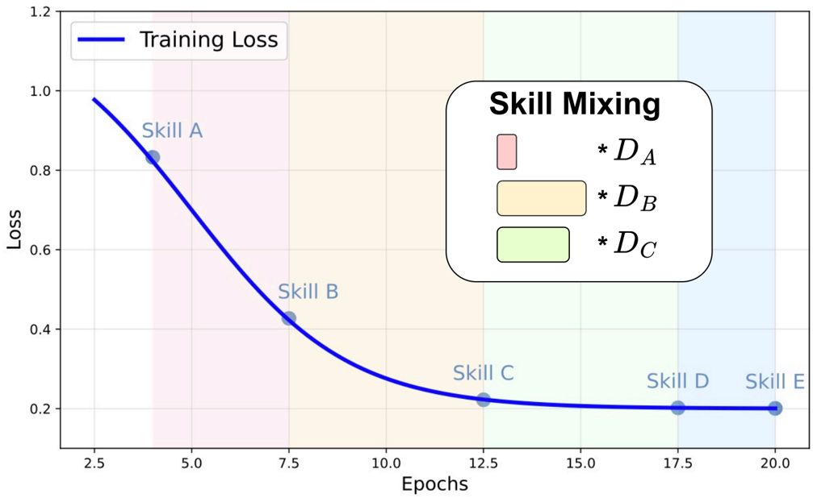
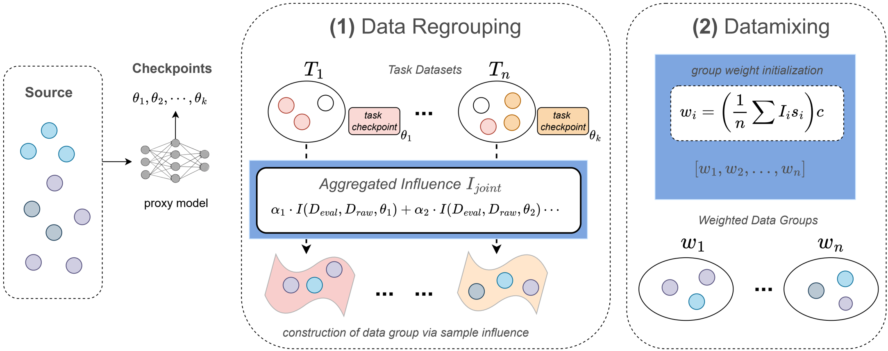
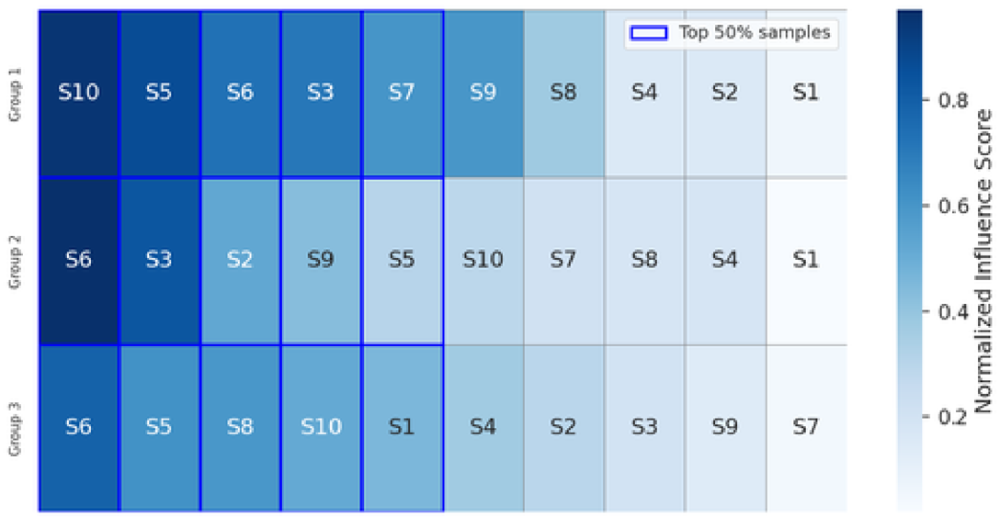
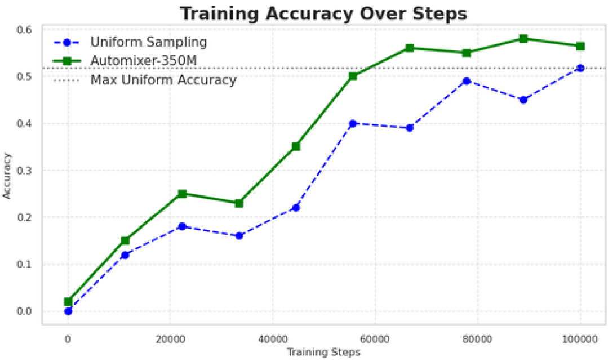
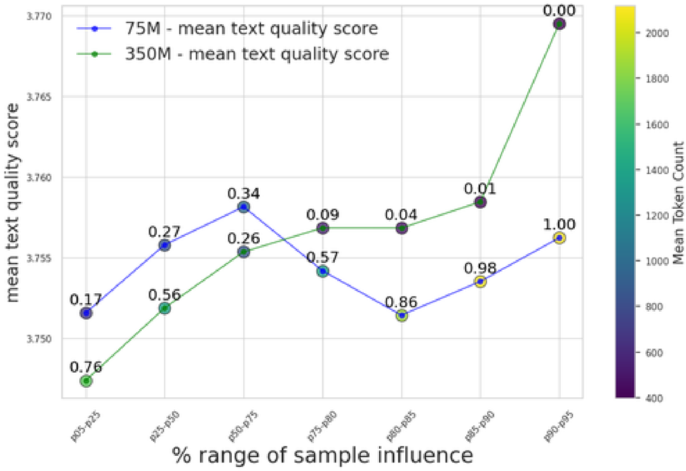
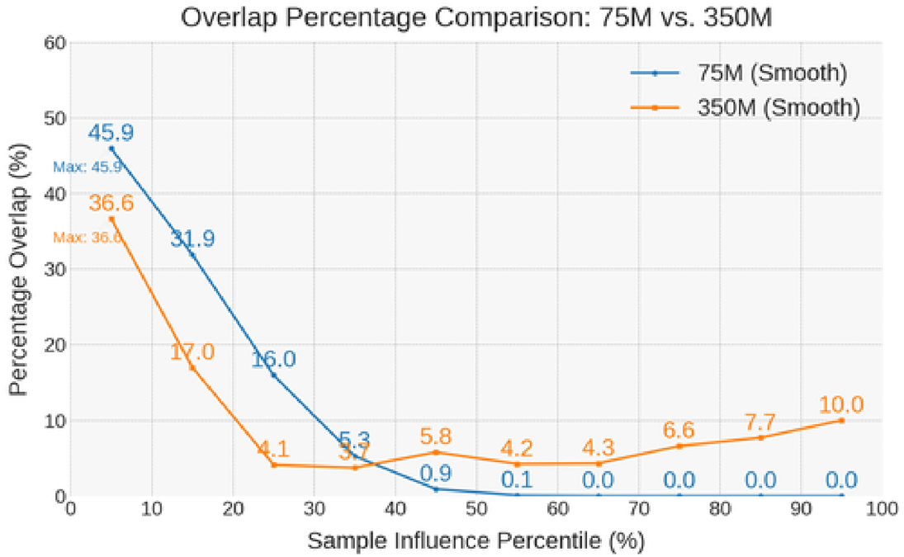

The paper introduces **AutoMixer**, a novel framework that utilizes intermediate model checkpoints, typically under-utilized training artifacts, as "automatic data mixers" to optimize the composition of pretraining data for language models.

### Problem Statement

The core problem addressed is the difficulty in effectively equipping language models with diverse capabilities due to the unclear relationship between training data and specific tasks. Traditional data mixing methods often fail to precisely identify task-specific data within heterogeneous corpora, especially when direct data-task mappings are ambiguous or knowledge regions overlap. This leads to inefficient data utilization. Furthermore, model capabilities emerge and evolve non-monotonically during training, creating a "chicken-and-egg" dilemma where knowing which data samples benefit a skill requires prior observation of that skill. Existing influence function methods typically rely on a single, often final, checkpoint, thus neglecting the dynamic nature of skill acquisition throughout the training trajectory.

### Methodology

AutoMixer proposes a two-fold approach: (1) identifying data mixtures or groups aligned with emerging model competencies, and (2) assigning sampling weights to these groups for task-aware data loading.

The framework operates by:
1.  **Checkpoint Selection**: It leverages intermediate checkpoints from a simulation run with proxy models (e.g., 75M or 350M parameters) that exhibit peak performance on specific tasks (see Table 1). These checkpoints act as "samplers." 
2.  **Data Regrouping via Sample Influence**:
    *   For each selected "task checkpoint" ($\theta_j$), a first-order influence approximation is computed for all raw data samples ($x_i$). The influence function estimates how much removing a sample would affect the model's performance on a validation set. The paper uses an efficient approximation method called DataInf (Kwon et al.).
    *   To enhance discriminability and save computation, influence scores are calculated primarily from the embedding and last Transformer layers, mitigating cancellation effects in intermediate layers.
    *   An aggregated influence score ($I_{\text{joint}}(x_i) = \sum_{j=1}^{k} \alpha_j \cdot I(D_{\text{eval}}, D_{\text{raw}}, \theta_j)$) is computed for each sample, blending contributions from all selected checkpoints. The blending factor ($\alpha_j$) for each checkpoint is derived from its normalized step number, reflecting its task acquisition speed.
    *   Raw data samples are then regrouped into task-specific datasets based on these utility (influence) scores. Within each group, samples are sorted by joint influence, and the top K% are retained to form the task-specific data groups, respecting token budgets. , 
3.  **Datamix Reweighting**:
    *   Sampling weights ($w_g$) are assigned to each regrouped data group $g$ based on its "group influence density" ($\rho_g$), which considers the aggregated influence scores and token counts of its samples.
    *   $w_g = \frac{\rho_g}{\sum_{g'=1}^{n} \rho_{g'}}$ ensures that groups with higher task-relevant influence are sampled with greater probability during pretraining, optimizing overall performance across all tasks while adhering to token budget constraints.

### Key Results & Analysis

AutoMixer, particularly with a 350M proxy model, shows significant performance improvements on reasoning benchmarks compared to uniform, perplexity (PPL), and N-gram sampling baselines.

| Approach                  | Model Parameters | ARC-EASY              | ARC-HARD             | BOOLQ                 | PIQA                 | SIQA                 | HELLASWAG            | OBQA                 | WINOGRANDE           | AVG.                 |
| :------------------------ | :--------------- | :-------------------- | :------------------- | :-------------------- | :------------------- | :------------------- | :------------------- | :------------------- | :------------------- | :------------------- |
| **PPL SAMPLING**          | 350M             | 0.35 ± 0.03           | 0.60 ± 0.05          | 0.44 ± 0.03           | 0.70 ± 0.04          | -0.10 ± 0.05         | 0.55 ± 0.03          | 0.40 ± 0.04          | 0.90 ± 0.06          | 0.66 ± 0.03          |
| **N-GRAM SAMPLING**       | 350M             | 0.74 ± 0.06           | 1.22 ± 0.04          | 0.79 ± 0.07           | 1.03 ± 0.05          | 1.09 ± 0.06          | 0.62 ± 0.03          | 1.16 ± 0.09          | 0.85 ± 0.04          | 0.60 ± 0.05          |
| **AUTOMIXER-75M**         | 350M             | -0.15 ± 0.07          | 0.12 ± 0.04          | -0.14 ± 0.05          | 0.01 ± 0.08          | -0.10 ± 0.03         | 0.05 ± 0.09          | -0.03 ± 0.06         | -0.05 ± 0.04         | -0.04 ± 0.05         |
| **AUTOMIXER-350M**        | 350M             | **2.23 ± 0.08**       | 0.55 ± 0.06          | **2.16 ± 0.09**       | **2.05 ± 0.07**      | **2.12 ± 0.10**      | **2.33 ± 0.06**      | **2.01 ± 0.08**      | **2.14 ± 0.05**      | **1.93 ± 0.07**      |
| **PPL SAMPLING**          | 1.5B             | 0.20 ± 0.07           | 0.52 ± 0.03          | 0.32 ± 0.06           | 0.40 ± 0.02          | 0.07 ± 0.05          | 0.18 ± 0.08          | 0.75 ± 0.03          | 0.68 ± 0.06          | 0.48 ± 0.04          |
| **N-GRAM SAMPLING**       | 1.5B             | 0.88 ± 0.06           | 0.82 ± 0.04          | 1.02 ± 0.07           | 0.58 ± 0.05          | 0.45 ± 0.09          | 1.22 ± 0.03          | 0.54 ± 0.05          | 0.90 ± 0.08          | 0.79 ± 0.06          |
| **AUTOMIXER-75M**         | 1.5B             | -0.06 ± 0.04          | 0.01 ± 0.06          | -0.04 ± 0.05          | -0.02 ± 0.07         | -0.05 ± 0.08         | 0.02 ± 0.06          | 0.01 ± 0.04          | -0.03 ± 0.05         | -0.02 ± 0.06         |
| **AUTOMIXER-350M**        | 1.5B             | **1.26 ± 0.05**       | 0.39 ± 0.09          | **1.35 ± 0.06**       | **1.22 ± 0.08**      | **1.38 ± 0.06**      | **1.45 ± 0.04**      | **1.33 ± 0.07**      | **1.41 ± 0.09**      | **1.22 ± 0.05**      |
| **PPL SAMPLING**          | 3B               | 0.18 ± 0.06           | 0.32 ± 0.04          | 0.10 ± 0.07           | 0.42 ± 0.05          | 0.27 ± 0.08          | 0.34 ± 0.03          | 0.50 ± 0.05          | 0.15 ± 0.09          | 0.20 ± 0.06          |
| **N-GRAM SAMPLING**       | 3B               | 0.82 ± 0.05           | 0.72 ± 0.07          | 0.57 ± 0.06           | 0.54 ± 0.04          | 0.64 ± 0.08          | 0.42 ± 0.05          | 0.95 ± 0.09          | 0.84 ± 0.06          | 0.50 ± 0.05          |
| **AUTOMIXER-75M**         | 3B               | -0.02 ± 0.06          | 0.01 ± 0.05          | -0.03 ± 0.08          | 0.00 ± 0.04          | -0.02 ± 0.07         | -0.01 ± 0.06         | -0.04 ± 0.03         | 0.02 ± 0.08          | -0.01 ± 0.06         |
| **AUTOMIXER-350M**        | 3B               | **1.09 ± 0.04**       | 0.34 ± 0.08          | **1.12 ± 0.06**       | **1.06 ± 0.07**      | **1.14 ± 0.05**      | **1.27 ± 0.09**      | **1.23 ± 0.08**      | **1.18 ± 0.05**      | **1.05 ± 0.07**      |

**Key Observations:**
*   **AutoMixer-350M** consistently achieves the highest improvements, demonstrating the effectiveness of the approach, especially when the proxy model size matches the target model size (e.g., 350M target model with 350M proxy model yields 1.93% average gain).
*   **AutoMixer-75M** generally underperforms, sometimes worse than uniform sampling, suggesting that a sufficiently capable proxy model is crucial.
*   PPL and N-gram sampling provide some gains but are less consistent and smaller than AutoMixer-350M.
*   **Ablation Study (Table 3 for 1.5B Model)**: Using the "Last Checkpoint" yields 0.7% average improvement, "10 Checkpoints" yields 0.8%, while AutoMixer-350M (selected checkpoints) achieves 1.22% average improvement, confirming the benefit of specific checkpoint selection and aggregation.
*   **Performance Trajectory (Figure 4)**: AutoMixer-350M maintains a consistent accuracy lead over uniform sampling throughout training, reaching 56.45% accuracy compared to 51.82% for uniform at 100k steps. 
*   **Impact of Proxy Model Sizes (Figure 5 & 6)**: Smaller proxy models (75M) are adept at identifying influential samples in longer sentences, useful for resource-constrained pruning. Larger proxy models (350M) excel at distinguishing and prioritizing samples with *higher* influence scores, indicating better precision for impactful sample selection. , 

### Core Contribution

The single most significant and novel contribution of this work is the **AutoMixer framework itself, which leverages intermediate model checkpoints (training artifacts) as dynamic, automatic data mixers.** By identifying these checkpoints based on their emergent task capabilities and using their aggregated first-order influence approximation over source data, AutoMixer systematically regroups and reweights pretraining data. This novel approach enables efficient identification of task-relevant data mixtures and their importance weights, addressing the "chicken-and-egg" problem and leading to substantial performance gains in language model pretraining.

### Open Source Contributions

The experiments utilize the **FineWebEdu dataset** (Lozhkov et al., 2024), which is an open-source dataset available under the Open Data Commons Attribution License (ODC-By) v1.0. It is described as a specialized educational corpus derived from FineWeb, with a foundational 1.3 trillion token collection and an expanded 5.4 trillion token iteration (FineWeb-Eduscore-2).

### Noteworthy Citations

1.  **Koh, P. W., Ang, K.-S., Teo, H. H. K., & Liang, P. S. (2019a). On the accuracy of influence functions for measuring group effects. In *Advances in Neural Information Processing Systems (NeurIPS)*.** This paper is foundational to the influence function methodology used by AutoMixer for quantifying sample utility.
2.  **Yeh, C.-K., Taly, A., Sundararajan, M., Liu, F., & Ravikumar, P. (2022). First is better than last for language data influence. In *Advances in Neural Information Processing Systems*.** This work is relevant to AutoMixer's "discriminative layer selection" strategy, which focuses on specific Transformer layers for influence computation.
3.  **Wei, J., Tay, Y., Bommasani, R., Raffel, C., Zoph, B., Borgeaud, S., Yogatama, D., Bosma, M., Zhou, D., Metzler, D., et al. (2022). Emergent abilities of large language models. *Transactions on Machine Learning Research*.** This paper provides important context for the concept of "emerging capabilities" in large language models, which AutoMixer capitalizes on by selecting checkpoints with specific task excellences.