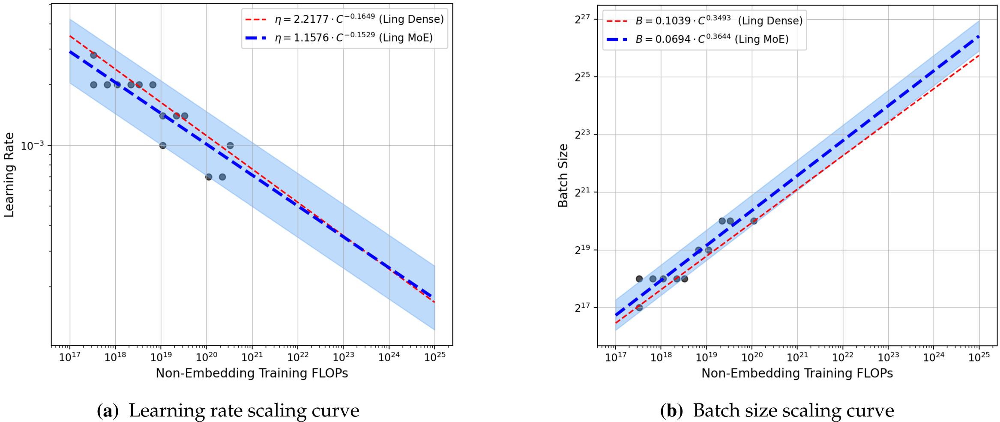
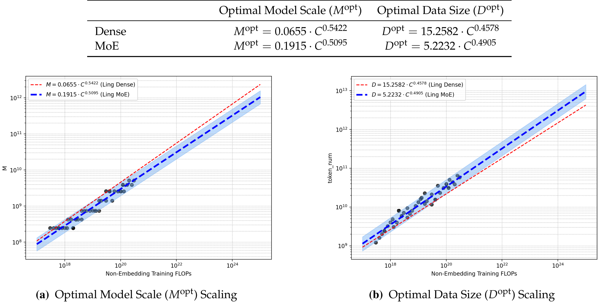
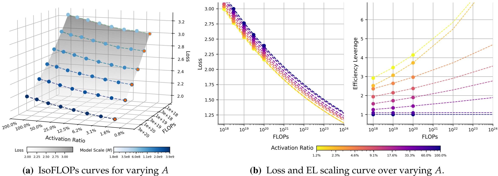
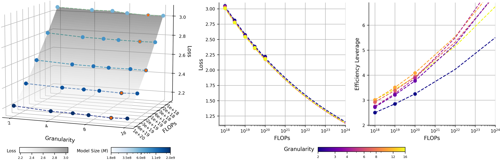
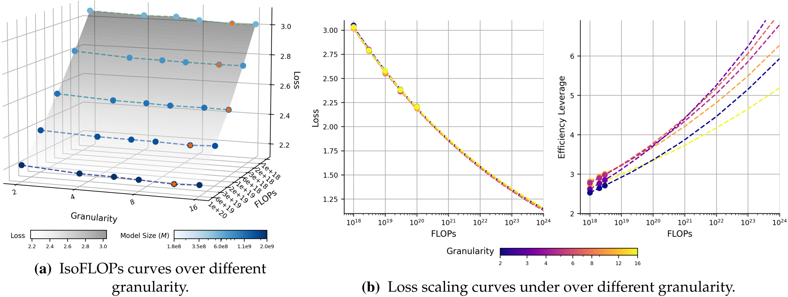
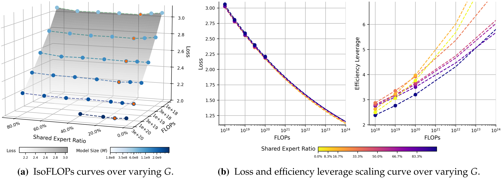
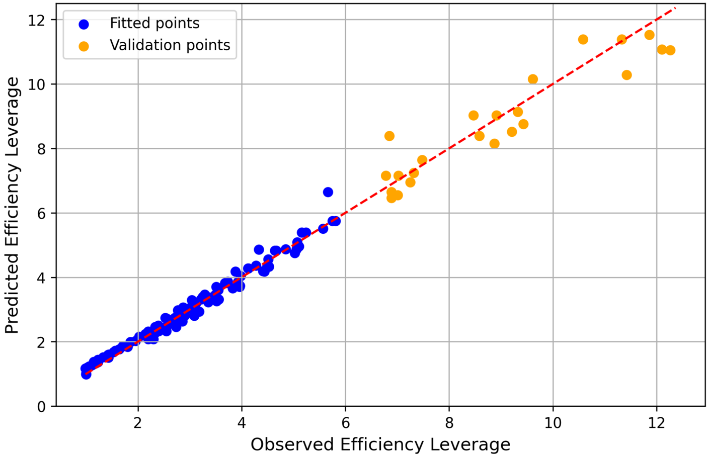
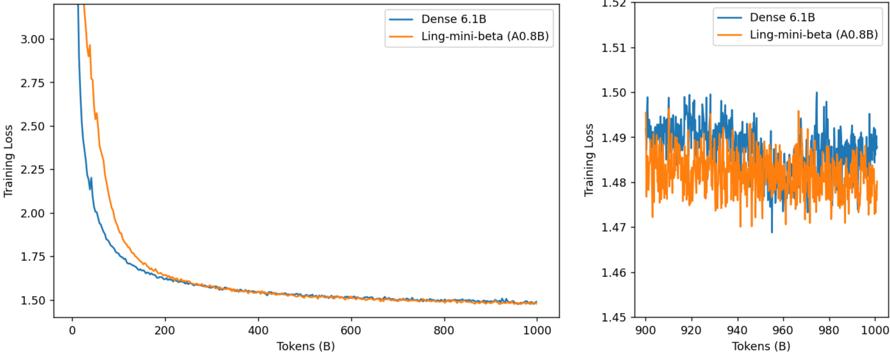
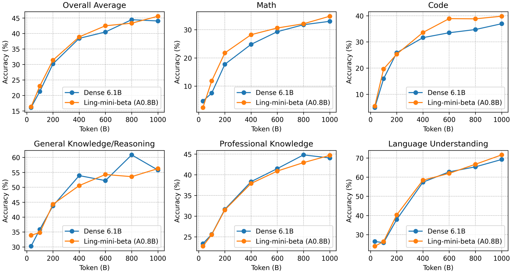
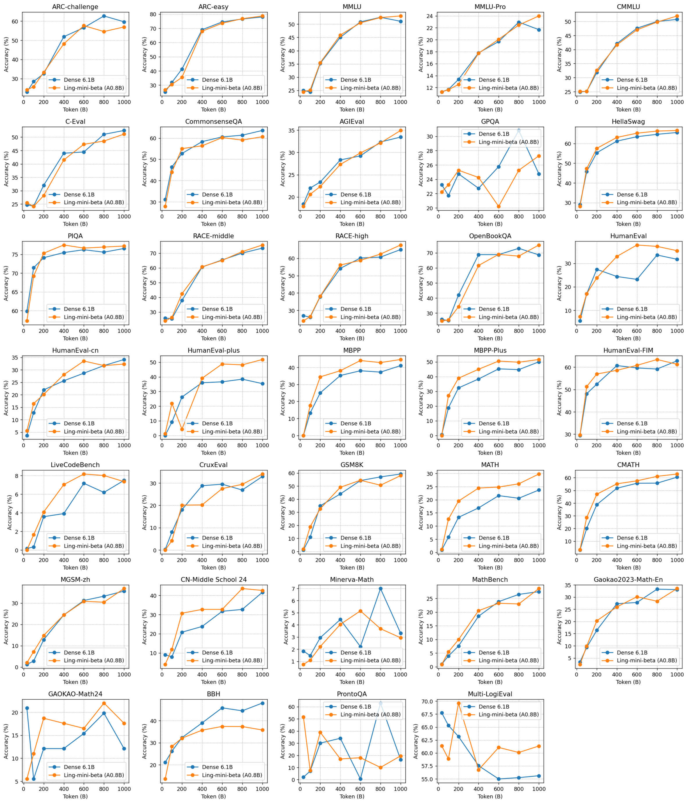

## Towards Greater Leverage: Scaling Laws for Efficient Mixture-of-Experts Language Models

### Problem Statement

Mixture-of-Experts (MoE) models offer efficient scaling for Large Language Models by decoupling total parameters from computational cost. However, this decoupling creates a critical challenge: there's no reliable way to predict the effective capacity or performance of a given MoE configuration (e.g., expert activation ratio, granularity) before pre-training. Existing scaling law research for MoE models has focused on isolated dimensions, failing to provide an integrated understanding of how architectural choices influence overall model capacity and efficiency. This leaves a significant gap in principled guidance for designing efficient MoE architectures.

### Methodology

The authors introduce **Efficiency Leverage (EL)**, a novel metric to quantify the computational advantage of an MoE model over a dense equivalent. EL is defined as the ratio of computational costs ($C_{dense} / C_{moe}$) required for both architectures to achieve the same performance level (e.g., identical loss). [Image 2a]

Their methodology involves a three-stage approach:
1.  **Scaling Laws for Optimal Hyperparameters and Model-Data Allocation**: Preliminary studies establish optimal learning rates, batch sizes, and model-data allocation strategies for both dense and MoE models across various compute budgets (3e17 to 3e20 FLOPs). This ensures all subsequent experiments are conducted under 'well-trained' and fair comparison conditions.
2.  **Deconstruction and Systematic Ablation Studies**: They systematically analyze the impact of key MoE architectural dimensions on EL:
    *   **Expert Activation Ratio (A)**: Varied from 0.8% to 100% (dense) by altering the total number of experts while keeping active FLOPs constant.
    *   **Expert Granularity (G)**: Varied from 2 to 16 by changing the number and size of experts while maintaining constant active FLOPs.
    *   **Shared Expert Ratio (S)**: Varied from 0% to 83.3% by substituting routed experts with shared experts.
    *   **Other Configurations**: Explored arrangement of MoE/dense layers and attention-FFN compute allocation.
    A large-scale empirical study involving over 300 models, trained up to 28B parameters, was conducted to gather data across these dimensions.
3.  **Unified Scaling Law Derivation**: Empirical findings are integrated into a single scaling law that predicts EL based on MoE configurations and the total compute budget.
4.  **Empirical Validation (Ling-mini-beta)**: A pilot MoE model, Ling-mini-beta (0.85B active, 17.5B total parameters), was designed based on the derived scaling laws and trained on 1T tokens. Its performance was compared against a 6.1B dense model trained on the same dataset.

### Key Results & Analysis

The study reveals several core principles governing MoE efficiency:

*   **Optimal Hyperparameters**: MoE models favor significantly larger batch sizes and slightly lower learning rates at large compute scales compared to dense models. 
*   **Optimal Model-Data Allocation**: For any given compute budget, optimal MoE models are computationally smaller (lower M_opt) but trained on more data (larger D_opt) than their dense counterparts (allocation coefficients around 0.5). 

| Architecture | Optimal Model Scale ($M_{opt}$)         | Optimal Data Size ($D_{opt}$)         |
| :----------- | :-------------------------------------- | :------------------------------------ |
| Dense        | $M_{opt} = 0.0655 \cdot C^{0.5422}$     | $D_{opt} = 15.2582 \cdot C^{0.4578}$ |
| MoE          | $M_{opt} = 0.1915 \cdot C^{0.5095}$     | $D_{opt} = 5.2232 \cdot C^{0.4905}$ |

*   **Activation Ratio (A)**: The primary determinant of EL. A stable power-law relationship exists where EL increases as A decreases (i.e., sparsity increases). This efficiency gain is amplified with larger compute budgets. 
*   **Expert Granularity (G)**: Acts as a non-linear modulator. A U-shaped (log-polynomial) relationship between loss and granularity implies an optimal range (found to be between 8 and 12 in their experiments). This optimal range is stable across different compute budgets. Poor routing balance shifts the optimum towards coarser granularities. , 
*   **Shared Expert Ratio (S)**: Exhibits a U-shaped relationship with loss, where a low, non-zero ratio is optimal. For large-scale pre-training, employing a single shared expert is a practical heuristic. The optimal ratio decreases as the compute budget increases. 
*   **Other Architectural Factors**:
    *   Replacing early MoE layers with dense layers has a minor impact on EL but helps mitigate routing imbalances and reduces total parameters. The optimal proportion of dense layers increases with compute. [Image 14a,b]
    *   Allocating 30%-40% of FLOPs to the attention mechanism provides optimal or near-optimal performance, demonstrating robustness across a broader range (20%-50%). [Image 14c,d]
*   **Unified Scaling Law (Eq. 13)**: A combined power-law and log-polynomial formula `EL = (A^(-α)) * (β (log G)^2 + γ log G)` where `α = a + d log C` accurately predicts EL. It shows strong extrapolation capabilities. 
*   **Ling-mini-beta Validation**:
    *   Ling-mini-beta (0.85B active parameters, 17.5B total) matched the performance of a 6.1B dense model while consuming over **7x fewer computational resources** on an identical 1T token dataset. 
    *   On a diverse suite of downstream tasks, Ling-mini-beta achieved an overall average score of **45.5%**, surpassing Dense-6.1B's **44.0%**, demonstrating a "small yet powerful" capability. Its active parameters are only 13% of the dense competitor's. , 

| Category                 | Metric                 | Dense-6.1B (%) | Ling-mini-beta (A0.8B) (%) |
| :----------------------- | :--------------------- | :------------- | :------------------------- |
| General Knowledge/Reasoning | Average                | 55.8           | 56.2                       |
| Professional Knowledge   | Average                | 44.0           | 44.7                       |
| Language Understanding   | Average                | 69.2           | 71.6                       |
| Code                     | Average                | 36.9           | 39.8                       |
| Math                     | Average                | 32.9           | 34.7                       |
| **Overall Average**      | **Overall Average**    | **44.0**       | **45.5**                   |

### Core Contribution

The most significant contribution is the introduction of **Efficiency Leverage (EL)** as a quantitative metric for MoE computational advantage and the derivation of a **unified, empirically-grounded scaling law** that accurately predicts EL based on the expert activation ratio, expert granularity, and total compute budget. This framework provides principled guidance for the efficient architectural design and scaling of Mixture-of-Experts language models, enabling direct prediction of an MoE model's performance equivalence to dense models without extensive trial-and-error.

### Open Source Contributions

The paper mentions "Ling-mini-beta, a pilot model for the Ling-2.0 series" developed by the Ling Team at Ant Group. While the Ling-2.0 series is implied to be a future model line, the paper does not explicitly state that Ling-mini-beta or its code/data are open-source, nor does it provide direct links to any open-source contributions from this specific work.

### Noteworthy Citations

1.  **Kaplan et al. (2020). Scaling laws for neural language models.** This foundational paper established the predictable power-law relationships between model performance and scale (compute, parameters, data).
2.  **Hoffmann et al. (2022). Training compute-optimal large language models.** Introduced the Chinchilla scaling laws, emphasizing the importance of balancing model size and training data for compute-optimal training.
3.  **Clark et al. (2022). Unified scaling laws for routed language models.** An early work exploring scaling laws specifically for MoE models, which this paper extends and refines.