## Kimi K2: Open Agentic Intelligence - Technical Report Summary

### 1. Problem Statement

The core problem addressed by the Kimi K2 technical report is the challenge of achieving "Agentic Intelligence" in Large Language Models (LLMs). This paradigm shift requires models to autonomously perceive, plan, reason, and act within complex environments, moving beyond static imitation learning. Key challenges include:
1.  **Pre-training**: Endowing models with broad general-purpose priors under constraints of limited high-quality data, emphasizing token efficiency.
2.  **Post-training**: Transforming these priors into actionable agentic behaviors (multi-step reasoning, long-term planning, tool use), which are rare in natural data and costly to scale. This necessitates scalable synthesis of structured, high-quality agentic trajectories and general reinforcement learning techniques.

### 2. Methodology

Kimi K2 is a Mixture-of-Experts (MoE) LLM with 1.04 trillion total parameters and 32 billion activated parameters. Its development spans novel pre-training and post-training techniques:

**Pre-training:**
*   **MuonClip Optimizer**: A novel optimizer integrating the token-efficient Muon algorithm with QK-Clip, a weight-clipping mechanism. QK-Clip rescales query and key projection weights post-update to bound the growth of attention logits, addressing training instability (e.g., exploding attention logits observed with vanilla Muon). This enabled stable pre-training on 15.5 trillion tokens without loss spikes. 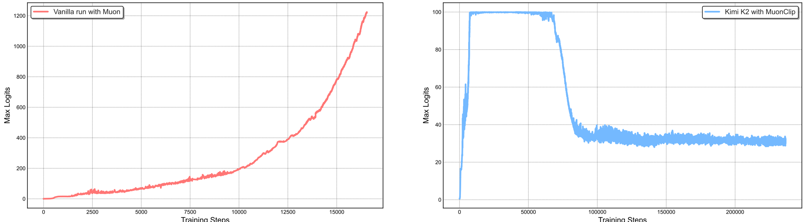
*   **Pre-training Data & Token Utility**: Focus on maximizing token efficiency through synthetic data generation via "rephrasing." Domain-specialized rephrasing pipelines for Knowledge (style- and perspective-diverse prompting, chunk-wise autoregressive generation, fidelity verification) and Mathematics data (rewriting into 'learning-note' style, multilingual translation) amplify high-quality tokens without overfitting. 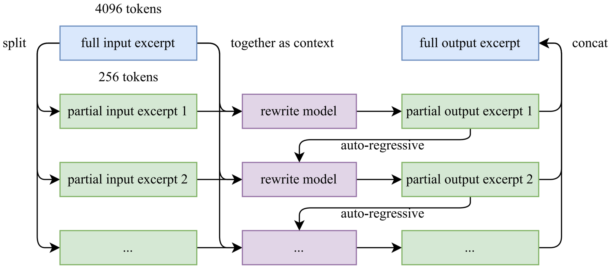
*   **Model Architecture**: Follows an ultra-sparse MoE with Multi-head Latent Attention (MLA), similar to DeepSeek-V3. Key architectural decisions, guided by sparsity scaling laws, include increasing total experts to 384 (from DeepSeek-V3's 256) for improved performance at fixed FLOPs, and reducing attention heads to 64 (from 128) to minimize inference overhead for long contexts. [Table 2], 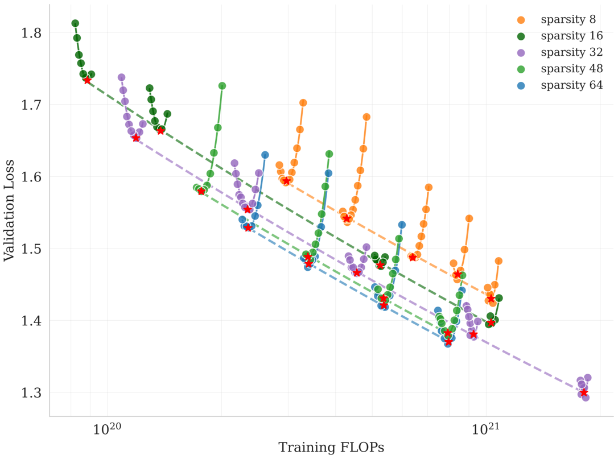, 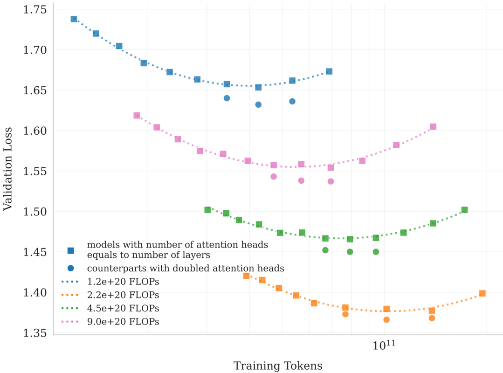
*   **Training Infrastructure**: Utilizes NVIDIA H800 GPUs with a flexible parallelism strategy combining 16-way Pipeline Parallelism (PP) with virtual stages, 16-way Expert Parallelism (EP), and ZeRO-1 Data Parallelism. Optimizations include EP communication overlap, selective recomputation, FP8 storage for insensitive activations, and activation CPU offload to manage GPU memory. 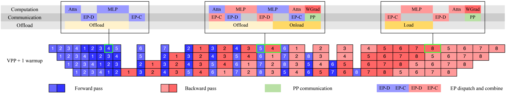

**Post-training:**
*   **Supervised Fine-Tuning (SFT)**: Built on a large-scale instruction-tuning dataset focused on prompt diversity and response quality, using human annotation, prompt engineering, and LLM/human evaluation.
*   **Large-Scale Agentic Data Synthesis**: A three-stage pipeline to generate diverse, high-quality tool-use demonstrations. 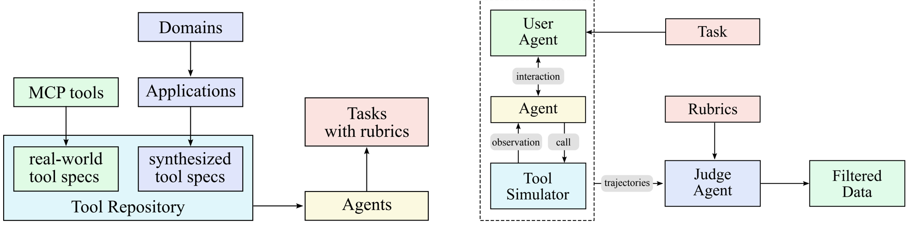
    1.  **Tool spec generation**: Repository of real-world (3000+ MCP tools) and LLM-synthesized (20,000+) tools covering diverse domains. 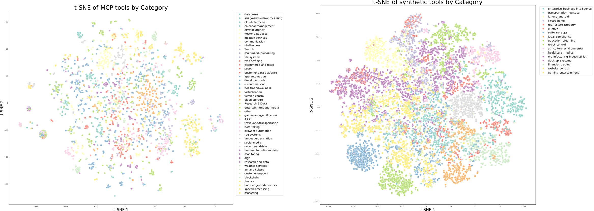
    2.  **Agent and task generation**: Thousands of distinct agents with varied tool combinations and tasks, each paired with explicit rubrics.
    3.  **Trajectory generation**: Multi-turn scenarios with LLM-generated user personas and a sophisticated tool simulator providing realistic feedback. A hybrid approach combines simulation with real execution sandboxes for coding tasks. Trajectories are quality-evaluated and filtered by an LLM-based judge.
*   **Reinforcement Learning (RL)**: A Gym-like extensible framework for RL across diverse scenarios, aiming for better token efficiency and generalization.
    *   **Verifiable Rewards Gym**: Incorporates Math, STEM, logical tasks (diverse, moderate difficulty), complex instruction following (hybrid verification, adversarial detection), faithfulness (sentence-level judge), and competitive coding/software engineering tasks (GitHub issues, unit tests in sandboxes). Also includes safety training via automated prompt evolution.
    *   **Self-Critique Rubric Reward**: Extends alignment to subjective tasks (creative writing, open-ended QA). The model's critic component evaluates its own outputs against core, prescriptive, and human-annotated rubrics, with a closed-loop refinement process using verifiable signals.
    *   **RL Algorithm Additions**: Budget control (per-sample token limits), PTX Loss (auxiliary loss to prevent forgetting high-quality SFT data), and Temperature Decay (shifting from exploration to exploitation).
    *   **RL Infrastructure**: Employs a colocated architecture (training and inference engines on the same workers), efficient engine switching using a distributed checkpoint engine for parameter updates (less than 30 seconds for 1T model), and optimized system startup. Agentic rollout supports long-horizon tasks with dedicated environment services, concurrent rollouts, and partial rollout to manage latency. 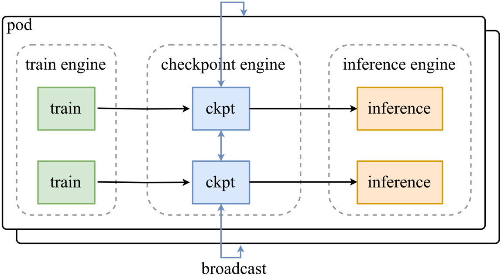, 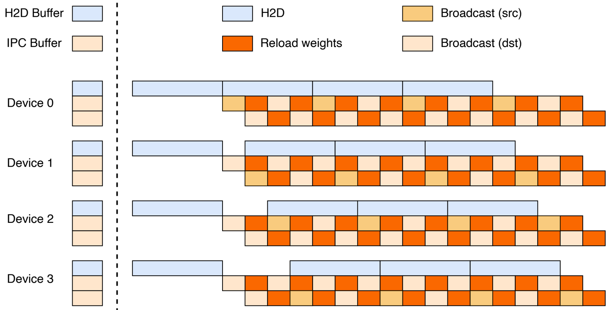

### 3. Key Results & Analysis

Kimi K2 achieves state-of-the-art performance among open-source non-thinking models, particularly in agentic capabilities, coding, mathematics, and reasoning.

**Performance Comparison (Kimi-K2-Instruct vs. Baselines - Non-thinking settings)** 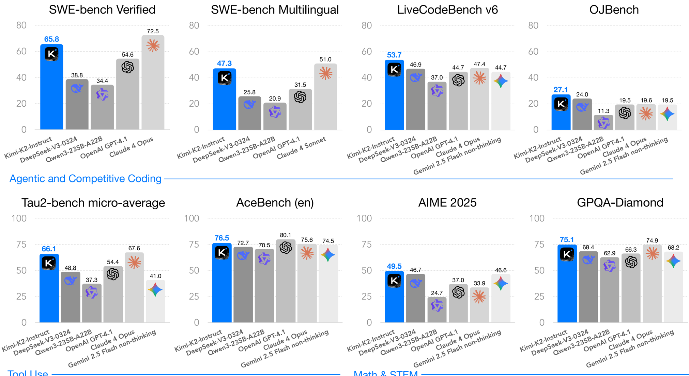, 

| Benchmark                                  | Kimi-K2-Instruct | DeepSeek-V3-0324 | Qwen3-235B-A22B | Claude Sonnet 4 | Claude Opus 4 | GPT-4.1 | Gemini 2.5 Flash |
| :----------------------------------------- | :--------------- | :--------------- | :-------------- | :-------------- | :------------ | :------ | :--------------- |
| **Agentic & Competitive Coding**           |                  |                  |                 |                 |               |         |                  |
| SWE-bench Verified Agentic-Single-Attempt  | **65.8**         | 38.8             | 34.4            | 72.7\*          | 72.5\*        | 54.6    | -                |
| SWE-bench Multilingual (Pass@1)            | **47.3**         | 25.8             | 20.9            | 51.0            | -             | 31.5    | -                |
| LiveCodeBench v6 (Pass@1)                  | **53.7**         | 46.9             | 37.0            | 48.5            | 47.4          | 44.7    | 44.7             |
| OJBench (Pass@1)                           | **27.1**         | 24.0             | 11.3            | 15.3            | 19.6          | 19.5    | 19.5             |
| **Tool Use Tasks**                         |                  |                  |                 |                 |               |         |                  |
| Tau2-Bench micro-average (Avg@4)           | **66.1**         | 48.8             | 37.3            | 58.7\*          | 66.3\*        | 55.9\*  | 41.0             |
| AceBench (Acc.)                            | **76.5**         | 72.7             | 70.5            | 76.2            | 75.6          | 80.1    | 74.5             |
| **Math & STEM Tasks**                      |                  |                  |                 |                 |               |         |                  |
| AIME 2025 (Avg@64)                         | **49.5**         | 46.7             | 24.7\*          | 33.1\*          | 33.9\*        | 37.0    | 46.6             |
| GPQA-Diamond (Avg@8)                       | **75.1**         | 68.4\*           | 62.9\*          | 70.0\*          | 74.9\*        | 66.3    | 68.2             |
| **General Tasks**                          |                  |                  |                 |                 |               |         |                  |
| MMLU (EM)                                  | **89.5**         | 89.4             | 87.0            | 91.5            | 92.9          | 90.4    | 90.1             |
| IFEval (Prompt Strict)                     | **89.8**         | 81.1             | 83.2\*          | 87.6            | 87.4          | 88.0    | 84.3             |
| **Long Context & Factuality**              |                  |                  |                 |                 |               |         |                  |
| FACTS Grounding (Adjusted Win rate)        | **88.5**         | 68.3             | 68.5            | 83.6            | -             | 79.2    | 86.6             |
| DROP (Acc.)                                | **93.5**         | 91.2             | 84.3            | 92.0            | -             | 79.1    | 81.7             |

*   **Agentic Capabilities**: Kimi K2 leads open-source models on Tau2-Bench (66.1) and ACEBench (76.5), outperforming most closed-source baselines in non-thinking settings.
*   **Coding & Software Engineering**: Achieves 65.8 on SWE-bench Verified (single attempt), 47.3 on SWE-bench Multilingual, and 53.7 on LiveCodeBench v6, demonstrating superior practical coding and real-world software engineering capabilities.
*   **Mathematics & Reasoning**: Scores 49.5 on AIME 2025 and 75.1 on GPQA-Diamond, showing strong performance in complex problem-solving.
*   **General Capabilities**: Exhibits strong performance on MMLU (89.5), MMLU-Redux (92.7), and excels in instruction following (IFEval: 89.8%, Multi-Challenge: 54.1%).
*   **Open-Ended Evaluation**: Ranks as the #1 open-source model and #5 overall on the LMSYS Arena leaderboard (July 17, 2025) based on over 3,000 user votes, and shows strong win rates in in-house Chinese benchmarks. 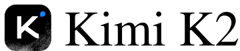, 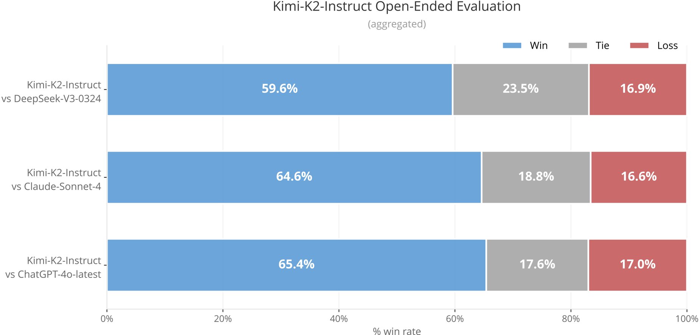
*   **Pre-training Evaluation (Base Model)**: Kimi-K2-Base shows state-of-the-art performance across English language understanding, coding, mathematical reasoning, and Chinese language understanding benchmarks compared to other leading open-source foundation models. [Table 4]
*   **Safety Evaluation**: Generally robust against various attack scenarios (Harmful, Criminal, Misinformation, Privacy, Security), with high passing rates across basic and Base64 strategies. However, more complex strategies like "Iterative Jailbreak" and "Crescendo" show reduced passing rates, similar to other models. [Table 6]

### 4. Core Contribution

The single most significant and novel contribution of this work is the **MuonClip optimizer** for stable and token-efficient pre-training of trillion-parameter MoE models, combined with a **comprehensive, scalable multi-stage post-training framework** that integrates large-scale agentic data synthesis (simulated and real-world environments) and a joint reinforcement learning pipeline leveraging both verifiable rewards and a novel self-critique rubric reward mechanism. This holistic approach significantly advances agentic intelligence capabilities in LLMs, as evidenced by Kimi K2's state-of-the-art performance across complex agentic and software engineering benchmarks.

### 5. Open Source Contributions

The authors state: "We release our base and post-trained model checkpoints to facilitate future research and applications of agentic intelligence."
The link provided is: `https://huggingface.co/moonshotai/Kimi-K2-Instruct`

### 6. Noteworthy Citations

1.  **[33] Keller Jordan et al. Muon: An optimizer for hidden layers in neural networks. 2024.** This paper is directly relevant as Muon is the foundation for the novel MuonClip optimizer used for Kimi K2's pre-training.
2.  **[10] DeepSeek-AI. DeepSeek-V3 Technical Report. 2024.** Kimi K2's architecture is explicitly stated to follow a similar design to DeepSeek-V3, making this a crucial reference for understanding the base model's design choices and comparisons.
3.  **[6] Chen Chen et al. 'ACEBench: Who Wins the Match Point in Tool Learning?' In: arXiv e-prints (2025), arXiv2501.** ACEBench is a key benchmark for evaluating agentic tool-use capabilities, a primary focus of Kimi K2. This citation provides critical context for the agentic training and evaluation.