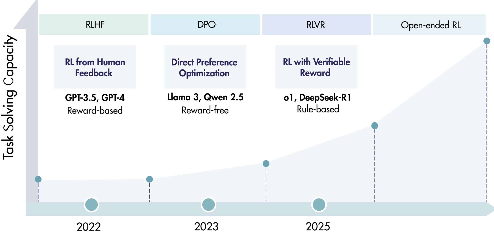
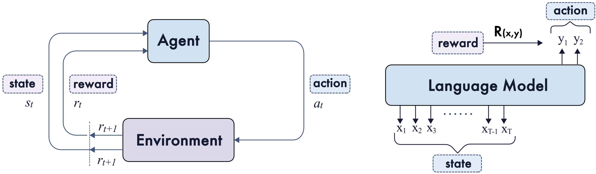
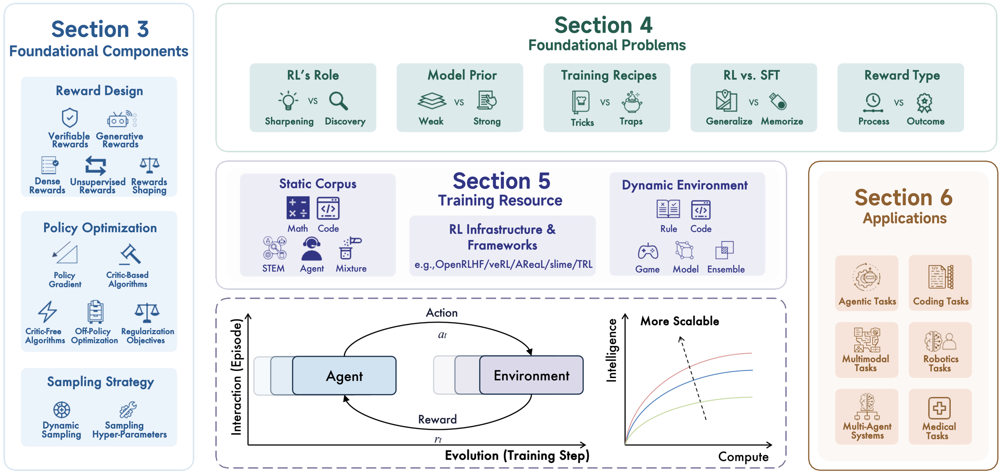
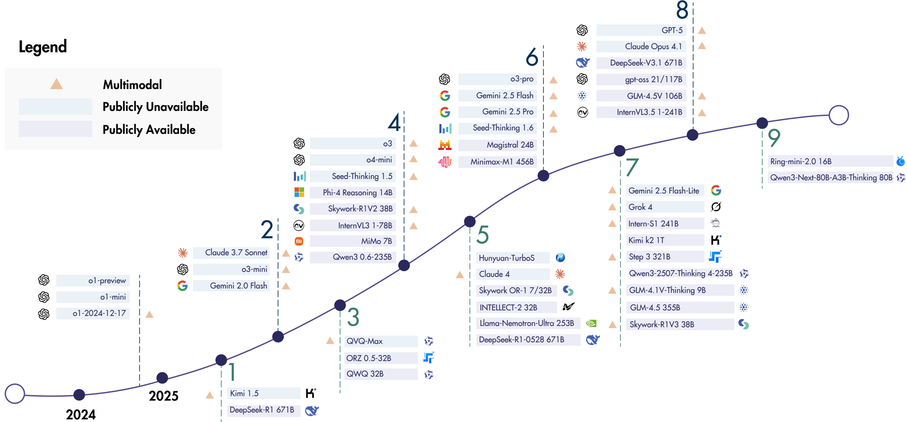

This survey provides a comprehensive overview of Reinforcement Learning (RL) applied to Large Reasoning Models (LRMs), focusing on its role in enhancing reasoning capabilities beyond traditional human alignment.

### 1. Problem Statement

The paper addresses the challenge of scaling Reinforcement Learning (RL) for Large Language Models (LLMs) to achieve advanced reasoning abilities, transforming them into Large Reasoning Models (LRMs). While RL has succeeded in human alignment (e.g., RLHF, DPO), further scaling for reasoning tasks (like mathematics and coding) faces foundational challenges in computational resources, algorithm design, training data, and infrastructure. The core problem is to systematically review the current landscape of RL for LRMs, reassess its trajectory, and identify strategies to enhance its scalability towards Artificial SuperIntelligence (ASI). The shift from human-aligned models to intrinsically reasoning models (RLVR) is a key trend, but its scaling limitations need to be understood and addressed.  illustrates this evolution.

### 2. Methodology

The authors conduct a structured survey of recent advances in RL for LRMs. Their methodology involves dissecting the field into several interconnected areas:

1.  **Foundational Components**: Reviewing the core building blocks of RL for LRMs, including:
    *   **Reward Design**: Examining verifiable, generative, dense, and unsupervised rewards, along with reward shaping techniques.
    *   **Policy Optimization**: Covering policy gradient objectives, critic-based and critic-free algorithms, off-policy optimization, and regularization objectives.
    *   **Sampling Strategies**: Discussing dynamic and structured sampling, and hyperparameter adjustment.
    This structure is visually represented in Figure 5 of the paper, detailing a taxonomy of these components.

2.  **Foundational Problems**: Identifying and discussing key controversial or unresolved issues in the field, such as RL's role (sharpening vs. discovery), RL vs. Supervised Fine-Tuning (SFT) (generalize vs. memorize), model priors (weak vs. strong), training recipes (tricks vs. traps), and reward types (process vs. outcome).

3.  **Training Resources**: Cataloging the essential resources required, including static corpora (Math, Code, STEM, Agentic, Mixed domains), dynamic environments (rule-based, code-based, game-based, model-based, ensemble-based), and RL infrastructure (primary and secondary development frameworks).

4.  **Applications**: Surveying the practical deployments of RL-trained LRMs across diverse domains, including coding, agentic tasks, multimodal tasks, multi-agent systems, robotics, and medical applications. Figure 6 in the paper shows a taxonomy of these applications.

The paper treats language models as agents within a Reinforcement Learning framework, mapping prompts to states, generated tokens to actions, and task outcomes to rewards . The overall structure of the survey is outlined in .

### 3. Key Results & Analysis

The survey synthesizes extensive findings from the literature, highlighting key trends, advancements, and persistent challenges in RL for LRMs:

*   **RLVR's Efficacy**: Reinforcement Learning with Verifiable Rewards (RLVR) has emerged as a foundational methodology, particularly after milestones like OpenAI o1 and DeepSeek-R1. It effectively trains LLMs for long-form reasoning in complex logical tasks like mathematics and coding by using explicit, rule-based rewards (e.g., answer correctness, unit-test pass rates).
*   **Sharpening vs. Discovery**: While initial views favored RL "sharpening" existing capabilities, recent evidence suggests that sufficient, stabilized RL can also lead to "discovery" of novel reasoning patterns, especially when training is prolonged and well-regularized (e.g., ProRL showing improvements in both Pass@1 and Pass@K).
*   **RL's Generalization Advantage**: RL tends to foster better out-of-distribution generalization compared to SFT, which can lead to memorization or catastrophic forgetting on non-target tasks. However, RL is not a panacea and its effectiveness is sensitive to initial data distribution and reward design. Hybrid SFT+RL approaches are often most effective.
*   **Impact of Model Priors**: Base models generally serve as better starting points for RL than heavily instruction-tuned models, which may have entrenched priors interfering with reward shaping. Model families show asymmetric responsiveness to RL, with some (e.g., Qwen) being more "RL-friendly" than others (e.g., Llama), indicating the importance of pre-training exposure to reasoning patterns and mid-training strategies.
*   **Dense vs. Sparse Rewards**: Dense, process-based rewards provide more fine-grained credit assignment and improve training efficiency/stability, often outperforming sparse, outcome-based rewards. However, process-level annotation is costly, and model-based dense rewards are susceptible to reward hacking. Combining both, possibly via implicit modeling or generative verifiers, is a promising direction.
*   **Importance of Dynamic Environments**: Static datasets are increasingly insufficient. Scalable RL for LRMs requires dynamic environments (rule-based, code-based, game-based, model-based) for automated, limitless data synthesis and step-level, multi-turn feedback.
*   **Emergence of Open-Source Models**: A vibrant open-source ecosystem is developing, with models like DeepSeek-R1, Qwen3, and InternVL3 pushing the boundaries of reasoning and multimodality using RL.

Here's a summary of representative open-source models trained with RL, highlighting the advancements in scale and methodology :

| Date    | Model                 | Organization    | Architecture | Parameters | Algorithm | Modal |
| :------ | :-------------------- | :-------------- | :----------- | :--------- | :-------- | :---- |
| 2025.01 | DeepSeek-R1           | DeepSeek        | MoE/MLA      | 671B       | GRPO      | Text  |
| 2025.03 | QwQ                   | Alibaba Qwen    | Dense        | 32B        | -         | Text  |
| 2025.04 | Skywork-R1V2          | Skywork         | Dense        | 38B        | MPO/GRPO  | T/I   |
| 2025.04 | InternVL3             | Shanghai AI Lab | Dense        | 1-78B      | MPO       | T/I/V |
| 2025.05 | Llama-Nemotron-Ultra  | NVIDIA          | Dense        | 253B       | GRPO      | Text  |
| 2025.06 | Minimax-M1            | Minimax         | Hybrid MoE   | 456B       | CISPO     | Text  |
| 2025.07 | Intern-S1             | Shanghai AI Lab | MoE          | 241B       | GRPO      | T/I/V |
| 2025.07 | Kimi K2               | Kimi            | MoE          | 1T         | OPMD      | Text  |
| 2025.08 | GLM-4.5V              | Zhipu AI        | MoE          | 106B       | GRPO      | T/I/V |

### 4. Core Contribution

The single most significant contribution of this work is providing the first comprehensive and systematic survey of Reinforcement Learning for Large Reasoning Models (LRMs), particularly since the emergence of DeepSeek-R1 and OpenAI o1. It uniquely re-frames RL's role beyond human alignment (RLHF/DPO) to explicitly incentivize and scale *reasoning capabilities* (RLVR). The survey unifies foundational components, identifies controversial problems, catalogs crucial training resources, and explores diverse applications, offering a timely roadmap and inspiration for advancing RL toward Artificial SuperIntelligence (ASI) through long-term interactions and evolutionary learning.

### 5. Open Source Contributions

The authors explicitly mention and link to an open-source repository for the survey itself:
*   **GitHub Repository for the Survey**: `TsinghuaC3I/Awesome-RL-for-LRMs`

Additionally, the paper lists numerous open-source models, datasets, and RL frameworks with their respective GitHub links within tables and text. Key examples include:
*   **DeepSeek-R1**: [Link to DeepSeek-R1 GitHub](https://github.com/a-m-team/a-m-models) (within Table 1, though the direct link points to 'a-m team' for `AM-DeepSeek-R1-0528-Distilled`). The paper also notes DeepSeek-R1's primary source [Guo et al., 2025a].
*   **OpenRLHF Framework**: [Link to OpenRLHF GitHub](https://github.com/OpenRLHF/OpenRLHF) (implicitly from the citation [Hu et al., 2024a] and context).
*   **AReaL Framework**: [Link to AReaL GitHub](https://github.com/TsinghuaC3I/AReAL) (implicitly from the citation [Fu et al., 2025b] and context).
*   **Static Corpus examples**: DAPO (`/github`), PRIME (`/github`), OpenReasoningZero (`/github`), KodCode (`/github`), etc. (within Table 4).
*   **Dynamic Environment examples**: AutoLogi (`/github`), Logic-RL (`/github`), MLE-Dojo (`/github`), ALFWorld (`/github`), lmgame-BENCH (`/github`), etc. (within Table 5).

### 6. Noteworthy Citations

1.  **[Guo et al., 2025a] (DeepSeek-R1):** This paper is frequently cited as a foundational work demonstrating the effectiveness and scalability of Reinforcement Learning with Verifiable Rewards (RLVR) for inducing complex reasoning behaviors in base models, a central theme of this survey.
2.  **[Jaech et al., 2024] (OpenAI o1):** Another landmark system, alongside DeepSeek-R1, showcasing that scaling train-time RL and test-time compute can lead to powerful reasoning abilities in LLMs.
3.  **[Sutton et al., 1998] (Introduction to Reinforcement Learning):** The seminal textbook on Reinforcement Learning, providing the fundamental theoretical background for all RL applications discussed in the survey.
4.  **[Ouyang et al., 2022] (Training language models to follow instructions with human feedback):** A key reference for Reinforcement Learning from Human Feedback (RLHF), the predecessor to RLVR in applying RL to LLMs, primarily for human alignment.